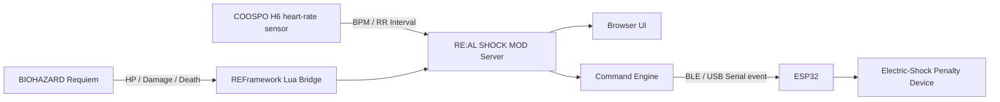

<p align="center">
  
</p>

# RE:AL SHOCK MOD


**In-game damage becomes a real electric shock.**

**RE:AL SHOCK MOD** is a local mod integration system for **BIOHAZARD Requiem / Resident Evil Requiem**. It watches the game state, reads the player's live heart-rate data, and sends commands to an **ESP32** when the player takes damage, dies, enters a low-HP faltering state, or physically startles.

The ESP32 receives those commands and triggers an electric-shock penalty on the real-world player.  
In other words: if the game hurts, reality answers.

Japanese version: [README.md](README.md)

Changelog: [CHANGELOG.md](CHANGELOG.md)

<p align="center">
  
</p>

## Target Game

| Link | What it is |
|---|---|
| [Steam store page](https://store.steampowered.com/app/3764200/Resident_Evil_Requiem/) | Steam version of BIOHAZARD Requiem / Resident Evil Requiem |
| [CAPCOM official page](https://www.residentevil.com/requiem/) | Official page for BIOHAZARD Requiem / Resident Evil Requiem |

## Setup

For the full copy-paste setup flow, from `git clone` to ESP32 BLE configuration, see [this setup guide](docs/SETUP.en.md).

## Main Parts Used

### Hardware To Buy

| Image | URL | What it is |
|---|---|---|
|  | [COOSPO Heart Rate Monitor](https://amzn.asia/d/03qclP31) | Chest-strap heart-rate sensor used to read BPM and RR intervals |
|  | [RELX EMS Belt](https://amzn.asia/d/0725U7pu) | Base device for the electric-shock penalty side |
|  | [DiyStudio ESP32 Development Board](https://amzn.asia/d/06wo77h9) | Wi-Fi/Bluetooth board that receives BLE/USB serial commands from the PC |
| Small electronics parts | Electronics shop, etc. | NPN transistors, resistors, jumper wires, and the emergency drain tact switch used for A/B/C button control |

## What This Is Trying To Do

The player plays BIOHAZARD normally.  
Behind the scenes, the PC watches both the game and the player's body.

| What happens | What the mod reads | What happens in reality |
|---|---|---|
| The player is bitten or attacked | HP drop, damage counter | Sends `damage` to ESP32, electric shock |
| The player dies | HP 0, death state | Sends `death` to ESP32, strongest penalty |
| HP enters danger range | In-game Danger state, or fallback HP at or below 16.75% | Sends `faltering`, warning shock |
| The player actually startles | RR interval drop, BPM rise | Sends `startle`, reaction penalty |
| Nothing is happening | Normal state | Sends `none`, clears output |

The concept is simple.

```text
REAL DAMAGE. REAL SHOCK. REAL SURVIVAL.
```

## System Overview



What is included in this repository:

| Part | Role |
|---|---|
| Python server | Combines BLE heart-rate data, REFramework bridge data, ESP32 output, and the Web UI |
| REFramework Lua Bridge | Exposes HP and damage state from the game |
| Browser UI | Shows biometric signals, game status, and the active command on one screen |
| ESP32 sender | Sends event commands to an ESP32 over BLE or USB serial |
| Sample biometric data | My real heart-rate logs used while tuning startle detection |

## Command Priority

When multiple events happen at the same time, the strongest command wins.

```text
death > damage > startle > faltering > none
```

| Priority | Command | Meaning |
|---:|---|---|
| 4 | `death` | Death. Highest priority |
| 3 | `damage` | Damage taken, HP drop |
| 2 | `startle` | Real-world startle response |
| 1 | `faltering` | Low-HP danger / faltering |
| 0 | `none` | Nothing happening / clear output |

## Screens And Commands

### Normal: `none`

Even when nothing is happening, the app sends `none` to the ESP32. This is the idle state that tells the external device to clear its output.

| Gameplay | RE:AL SHOCK MOD UI |
|---|---|
|  |  |

### Damage: `damage`

If HP drops, reality answers.  
This is the most direct part of the mod.

| Gameplay | RE:AL SHOCK MOD UI |
|---|---|
|  |  |

```json
{
  "command": "damage",
  "priority": 3,
  "payload": {
    "hp_percent": 42,
    "damage_count": 7
  }
}
```

### Faltering: `faltering`

When the game reports the player is in the Danger state, the player is in the danger zone. If that game-side Danger signal is unavailable, HP at **16.75% or lower** is used as a fallback. This is meant for a warning shock rather than the strongest penalty.

| Gameplay | RE:AL SHOCK MOD UI |
|---|---|
|  |  |

### Death: `death`

Game over is the highest-priority command.  
Even if `damage` or `startle` is also active, `death` wins.

| Gameplay | RE:AL SHOCK MOD UI |
|---|---|
|  |  |

### Startle: `startle`

Even if the game does not report damage, the app can detect "you just flinched" from a sudden heart-rate pattern.  
The current logic tracks the reaction for **3 seconds** to reduce false positives from posture changes or yawning.

| Reference gameplay | RE:AL SHOCK MOD UI |
|---|---|
|  |  |

## What The Biometric Side Watches

Raw BPM alone is weak, so the detector also watches RR interval behavior.

| Signal | What the system looks for |
|---|---|
| BPM | Delayed rise after a reaction |
| RR interval | Sudden shortening right after a startle |
| RMSSD / pNN50 | Often drops when tension increases |
| Movement score | Posture changes, yawns, and noisy false-positive candidates |
| Difference from recent baseline | How far the player deviates from their own normal state |

The included CSV data contains real logs from horror movies, BIOHAZARD gameplay, Gonjiam, posture-change tests, and yawning. The detector was tuned by comparing real startles against body-movement false positives.

## Command Sent To ESP32

By default, the PC auto-discovers the BLE device named `RealShockESP32` and sends one-line commands to the ESP32. USB serial is also available for debugging.

```text
event <kind> <level> <duration_ms> <id>
```

Example command:

```text
event damage 10 3000 42
```

The PC converts `damage` / `death` / `startle` / `faltering` into a level and duration, then the ESP32 converts that into A/B/C button presses. HTTP JSON remains as a compatibility path, but it is not the default route.

| Command | Example use |
|---|---|
| `none` | Clear output |
| `faltering` | Light warning |
| `startle` | Short electric shock |
| `damage` | Damage penalty |
| `death` | Game-over penalty |

## ESP32 Button Control Addendum

The current implementation has the ESP32 operate the external device's A/B/C buttons. The original concept, screenshots, and images remain in this README, while the implemented ESP32 path auto-discovers the BLE device named `RealShockESP32` and sends `event <kind> <level> <duration_ms> <id>`. USB serial is still available as a debug fallback.

Button mapping is `A=GPIO33` for intensity up, `B=GPIO32` for mode change, and `C=GPIO25` for intensity down. ESP32 `GPIO34` is input-only, so it is not used for button output. On startup, the ESP32 presses C three times to drain any stale level, then presses A once to reach level 0 and B twice to enter mode 3. If level 0 has been idle for 13+ seconds, the firmware presses C once before the next output, treats the device as `-1`, then presses A until the requested level is reached. Repeated C presses inside the ESP32 use a 30ms gap.

The emergency drain tact switch uses `GPIO27`. The ESP32 reads it with `INPUT_PULLUP`, so wire one side of the switch to `GPIO27` and the other side to `GND`. Do not connect the switch to `3V3`. When pressed, the ESP32 presses C 30 times and marks its internal state as uninitialized.

The PC sends a single `event <kind> <level> <duration_ms> <id>` line. The ESP32 performs the A/C button sequence and returns to level 0 after the event duration. BLE/Serial sends periodic `status` keepalives while idle so the next damage event is less likely to wait on reconnection.

All mode switches live in the Control panel. When `Low output Lv10` is enabled in the UI, the normal max-Lv15 scale is normalized to max Lv10 before commands are sent to the ESP32. For example, Lv15 becomes Lv10 and Lv12 becomes Lv8. When `Debug max Lv3` is enabled, both live detection and manual debug commands are capped at level 3 before they are sent to the ESP32. `English UI` switches the dashboard text to English. Transient HP 0 samples around character switching are ignored briefly so they do not produce false `damage` or `death` commands.

Added firmware and debug tool:

```text
esp32/real_shock_controller/real_shock_controller.ino
tools/esp32_debug.py
```

Default BLE settings:

```text
REAL_SHOCK_ESP32_TRANSPORT=ble
REAL_SHOCK_ESP32_BLE_NAME=RealShockESP32
```

Output rules:

| Command | Device output |
|---|---|
| `none` | Return to level 0 or below |
| `damage` | Lv14/12/10/8/6/4 for 4.0/3.5/3.0/2.5/2.0/1.0s based on remaining HP |
| `faltering` | Starts at Lv3 and rises to Lv10 by Danger duration; its timer continues behind higher-priority events |
| `startle` | Random Lv5-15 for 1-4s |
| `death` | Lv15 for 10s |

ESP32 debug commands:

| Command | Meaning |
| --- | --- |
| `button A` / `button B` / `button C` | Press one button once |
| `hold C 5000` | Hold a button for wiring checks |
| `drain` | Press C 30 times; same action as the GPIO27 emergency switch |
| `cycle 4 30` | Raise to level 4, wait 1s, then return to 0 with 30ms C gaps |

## API

| Method | Path | Purpose |
|---|---|---|
| `GET` | `/` | Main UI |
| `GET` | `/api/snapshot` | Full state |
| `GET` | `/api/game` | Game-side state |
| `GET` | `/api/commands` | Active command state |
| `GET` | `/api/esp32` | ESP32 sender state |
| `GET` / `POST` | `/api/settings` | Read or update UI language, low-output mode, and debug cap |
| `POST` | `/api/debug/command/death` | Debug death command |
| `POST` | `/api/debug/command/damage` | Debug damage command |
| `POST` | `/api/debug/command/startle` | Debug startle command |
| `POST` | `/api/debug/command/faltering` | Debug faltering command |
| `POST` | `/api/debug/command/none` | Clear command |

## Extra: Real Biometric Data

My real COOSPO H6 biometric logs are included.

```text
docs/sample-data/biometric/
```

| Data | Contents |
|---|---|
| `relax.csv` | Relaxed baseline |
| `resident-evil.csv` | BIOHAZARD gameplay |
| `horror-movie.csv` | Horror movie |
| `horror-friends-house.csv` | Horror movie "friend's house" |
| `gonjiam.csv` | Long horror movie session, Gonjiam |
| `the-girl-encounter.csv` | The Girl encounter |
| `yawn.csv` | Yawn false-positive candidate |
| `posture-heavy.csv` / `single-posture.csv` | Posture-change tests |

See [docs/sample-data/biometric/README.md](docs/sample-data/biometric/README.md) and [manifest.json](docs/sample-data/biometric/manifest.json).

## Repository Layout

```text
h6_monitor_server.py          aiohttp + BLE + RE9 + ESP32 server
static/                       One-screen browser UI
reframework/                  REFramework Lua Bridge
scripts/                      Install, launch, and shortcut scripts
docs/images/                  README images
docs/sample-data/biometric/   Real biometric CSV data
Install-RE-AL-SHOCK-MOD.cmd   Double-click installer
Start-RE-AL-SHOCK-MOD.cmd     Double-click launcher
```

## Notice

This is a personal experimental local mod-integration project. It is not affiliated with Capcom, BIOHAZARD, Resident Evil, Steam, COOSPO, or REFramework.

Electrical stimulation is your own responsibility. The PC app only sends commands to an ESP32. Output limits, repeated-output prevention, emergency stop behavior, and any other safety controls must be handled by the ESP32 firmware or the external device.
