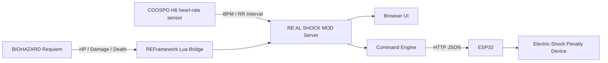

<p align="center">
  
</p>

# RE:AL SHOCK MOD


**In-game damage becomes a real electric shock.**

**RE:AL SHOCK MOD** is a local mod integration system for **BIOHAZARD Requiem / Resident Evil Requiem**. It watches the game state, reads the player's live heart-rate data, and sends commands to an **ESP32** when the player takes damage, dies, enters a low-HP faltering state, or physically startles.

The ESP32 receives those commands and triggers an electric-shock penalty on the real-world player.  
In other words: if the game hurts, reality answers.

Japanese version: [README.md](README.md)

<p align="center">
  
</p>

## Main Parts Used

### Hardware To Buy

| Image | URL | What it is |
|---|---|---|
|  | [COOSPO Heart Rate Monitor](https://amzn.asia/d/03qclP31) | Chest-strap heart-rate sensor used to read BPM and RR intervals |
|  | [RELX EMS Belt](https://amzn.asia/d/0725U7pu) | Base device for the electric-shock penalty side |
|  | [DiyStudio ESP32 Development Board](https://amzn.asia/d/06wo77h9) | Wi-Fi/Bluetooth board that receives HTTP commands from the PC |
|  | [KKHMF 5V 1-Channel Relay Module](https://amzn.asia/d/0ijeHtMs) | Relay module used to switch an external device from an ESP32 signal |

### Software To Install

| Link | What it is |
|---|---|
| [Git for Windows](https://git-scm.com/download/win) | Required for `git clone` |
| [Python 3.10+](https://www.python.org/downloads/windows/) | Runs the local RE:AL SHOCK MOD server |
| [REFramework Releases](https://github.com/praydog/REFramework/releases) | Mod framework used to read the game state. The installer script can also install it |

## Fastest Setup

Open PowerShell and install the basic tools if they are missing.

```powershell
winget install --id Git.Git -e
winget install --id Python.Python.3.12 -e
```

Then run these commands in any folder where you want the project.

```powershell
git clone https://github.com/Saisei2004/real-shock-mod.git
cd real-shock-mod
.\Install-RE-AL-SHOCK-MOD.cmd
.\Start-RE-AL-SHOCK-MOD.cmd
```

Open the dashboard:

```text
http://127.0.0.1:8765/
```

If REFramework is not installed yet, use this install command instead.

```powershell
.\scripts\Install-RealShockMod.ps1 -InstallRe9Bridge -InstallREFramework -IUnderstandGameMayBeAffected
```

To send commands to an ESP32, set the ESP32 URL before launching.

```powershell
$env:REAL_SHOCK_ESP32_URL = "http://192.168.0.50/command"
.\Start-RE-AL-SHOCK-MOD.cmd
```

## What This Is Trying To Do

The player plays BIOHAZARD normally.  
Behind the scenes, the PC watches both the game and the player's body.

| What happens | What the mod reads | What happens in reality |
|---|---|---|
| The player is bitten or attacked | HP drop, damage counter | Sends `damage` to ESP32, electric shock |
| The player dies | HP 0, death state | Sends `death` to ESP32, strongest penalty |
| HP enters danger range | HP at or below 16.75% | Sends `faltering`, warning shock |
| The player actually startles | RR interval drop, BPM rise | Sends `startle`, reaction penalty |
| Nothing is happening | Normal state | Sends `none`, clears output |

The concept is simple.

```text
REAL DAMAGE. REAL SHOCK. REAL SURVIVAL.
```

## System Overview



What is included in this repository:

| Part | Role |
|---|---|
| Python server | Combines BLE heart-rate data, REFramework bridge data, ESP32 output, and the Web UI |
| REFramework Lua Bridge | Exposes HP and damage state from the game |
| Browser UI | Shows biometric signals, game status, and the active command on one screen |
| ESP32 sender | Sends command JSON to an ESP32 on the same network |
| Sample biometric data | Real heart-rate logs used while tuning startle detection |

## Command Priority

When multiple events happen at the same time, the strongest command wins.

```text
death > damage > startle > faltering > none
```

| Priority | Command | Meaning |
|---:|---|---|
| 4 | `death` | Death. Highest priority |
| 3 | `damage` | Damage taken, HP drop |
| 2 | `startle` | Real-world startle response |
| 1 | `faltering` | Low-HP danger / faltering |
| 0 | `none` | Nothing happening / clear output |

## Screens And Commands

### Normal: `none`

Even when nothing is happening, the app sends `none` to the ESP32. This is the idle state that tells the external device to clear its output.

| Gameplay | RE:AL SHOCK MOD UI |
|---|---|
|  |  |

### Damage: `damage`

If HP drops, reality answers.  
This is the most direct part of the mod.

| Gameplay | RE:AL SHOCK MOD UI |
|---|---|
|  |  |

```json
{
  "command": "damage",
  "priority": 3,
  "payload": {
    "hp_percent": 42,
    "damage_count": 7
  }
}
```

### Faltering: `faltering`

When HP drops to **16.75% or lower**, the player is in the danger zone. This is meant for a warning shock rather than the strongest penalty.

| Gameplay | RE:AL SHOCK MOD UI |
|---|---|
|  |  |

### Death: `death`

Game over is the highest-priority command.  
Even if `damage` or `startle` is also active, `death` wins.

| Gameplay | RE:AL SHOCK MOD UI |
|---|---|
|  |  |

### Startle: `startle`

Even if the game does not report damage, the app can detect "you just flinched" from a sudden heart-rate pattern.  
The current logic tracks the reaction for **3 seconds** to reduce false positives from posture changes or yawning.

| Reference gameplay | RE:AL SHOCK MOD UI |
|---|---|
|  |  |

## What The Biometric Side Watches

Raw BPM alone is weak, so the detector also watches RR interval behavior.

| Signal | What the system looks for |
|---|---|
| BPM | Delayed rise after a reaction |
| RR interval | Sudden shortening right after a startle |
| RMSSD / pNN50 | Often drops when tension increases |
| Movement score | Posture changes, yawns, and noisy false-positive candidates |
| Difference from recent baseline | How far the player deviates from their own normal state |

The included CSV data contains real logs from horror movies, BIOHAZARD gameplay, Gonjiam, posture-change tests, and yawning. The detector was tuned by comparing real startles against body-movement false positives.

## JSON Sent To ESP32

Set the ESP32 HTTP endpoint:

```powershell
$env:REAL_SHOCK_ESP32_URL = "http://192.168.0.50/command"
```

Example payload:

```json
{
  "system": "RE:AL SHOCK MOD",
  "command": "damage",
  "label": "ダメージ",
  "priority": 3,
  "source": "re9-bridge",
  "issued_at": "2026-05-18T02:18:42.120",
  "payload": {
    "hp_percent": 42,
    "damage_count": 7
  }
}
```

The ESP32 can switch shock patterns based on the `command` value.

| Command | Example use |
|---|---|
| `none` | Clear output |
| `faltering` | Light warning |
| `startle` | Short electric shock |
| `damage` | Damage penalty |
| `death` | Game-over penalty |

## Extra Setup Notes

The [Fastest Setup](#fastest-setup) section is the recommended path. These are the individual commands if you want to do each step manually.

### Get The Repository

With Git:

```powershell
git clone https://github.com/Saisei2004/real-shock-mod.git
cd real-shock-mod
```

Without Git:

[Download ZIP](https://github.com/Saisei2004/real-shock-mod/archive/refs/heads/main.zip)

### Install

```powershell
.\Install-RE-AL-SHOCK-MOD.cmd
```

This installs Python dependencies, installs the Lua bridge, and creates a desktop shortcut.

### Install REFramework Too

```powershell
.\scripts\Install-RealShockMod.ps1 -InstallRe9Bridge -InstallREFramework -IUnderstandGameMayBeAffected
```

### Install Only The Lua Bridge

```powershell
.\scripts\Install-Re9Bridge.ps1 -InstallLua
```

### Check Bridge Status

```powershell
.\scripts\Install-Re9Bridge.ps1
```

## Launch

Use the desktop shortcut, or run:

```text
Start-RE-AL-SHOCK-MOD.cmd
```

Or:

```powershell
.\scripts\Start-RealShockMod.ps1
```

Open:

```text
http://127.0.0.1:8765/
```

Demo UI URLs for README-style screenshots:

```text
http://127.0.0.1:8765/?demo=damage
```

Available demo values: `normal`, `startle`, `damage`, `faltering`, `death`.

## Configuration

```powershell
$env:REAL_SHOCK_PORT = "8765"
$env:REAL_SHOCK_H6_ADDRESS = ""
$env:REAL_SHOCK_H6_NAME_PREFIX = "H6"
$env:REAL_SHOCK_ESP32_URL = "http://192.168.0.50/command"
$env:REAL_SHOCK_ESP32_TIMEOUT = "2.0"
```

| Variable | Meaning |
|---|---|
| `REAL_SHOCK_PORT` | Local server port |
| `REAL_SHOCK_H6_ADDRESS` | BLE address. Leave empty for auto-detect |
| `REAL_SHOCK_H6_NAME_PREFIX` | Heart-rate sensor name prefix |
| `REAL_SHOCK_ESP32_URL` | HTTP URL used to send commands to ESP32 |
| `REAL_SHOCK_ESP32_TIMEOUT` | ESP32 send timeout in seconds |

## API

| Method | Path | Purpose |
|---|---|---|
| `GET` | `/` | Main UI |
| `GET` | `/api/snapshot` | Full state |
| `GET` | `/api/game` | Game-side state |
| `GET` | `/api/commands` | Active command state |
| `GET` | `/api/esp32` | ESP32 sender state |
| `POST` | `/api/debug/command/death` | Debug death command |
| `POST` | `/api/debug/command/damage` | Debug damage command |
| `POST` | `/api/debug/command/startle` | Debug startle command |
| `POST` | `/api/debug/command/faltering` | Debug faltering command |
| `POST` | `/api/debug/command/none` | Clear command |

## Extra: Real Biometric Data

Real COOSPO H6 biometric logs are included.

```text
docs/sample-data/biometric/
```

| Data | Contents |
|---|---|
| `relax.csv` | Relaxed baseline |
| `resident-evil.csv` | BIOHAZARD gameplay |
| `horror-movie.csv` | Horror movie |
| `horror-friends-house.csv` | Horror movie "friend's house" |
| `gonjiam.csv` | Long horror movie session, Gonjiam |
| `the-girl-encounter.csv` | The Girl encounter |
| `yawn.csv` | Yawn false-positive candidate |
| `posture-heavy.csv` / `single-posture.csv` | Posture-change tests |

See [docs/sample-data/biometric/README.md](docs/sample-data/biometric/README.md) and [manifest.json](docs/sample-data/biometric/manifest.json).

## Repository Layout

```text
h6_monitor_server.py          aiohttp + BLE + RE9 + ESP32 server
static/                       One-screen browser UI
reframework/                  REFramework Lua Bridge
scripts/                      Install, launch, and shortcut scripts
docs/images/                  README images
docs/sample-data/biometric/   Real biometric CSV data
Install-RE-AL-SHOCK-MOD.cmd   Double-click installer
Start-RE-AL-SHOCK-MOD.cmd     Double-click launcher
```

## Images

The UI screenshots in this README are captured from the actual `static/index.html`, `static/app.js`, and `static/styles.css` using the `?demo=` pseudo-data mode.  
Gameplay screenshots were provided by the author. The concept image and logo are visuals used to communicate the feel of the project.

## Notice

This is a personal experimental local mod-integration project. It is not affiliated with Capcom, BIOHAZARD, Resident Evil, Steam, COOSPO, or REFramework.

Electrical stimulation is your own responsibility. The PC app only sends commands to an ESP32. Output limits, repeated-output prevention, emergency stop behavior, and any other safety controls must be handled by the ESP32 firmware or the external device.
