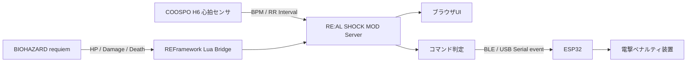

<p align="center">
  
</p>

# RE:AL SHOCK MOD


**ゲーム内のダメージが、現実の電撃になる。**

**RE:AL SHOCK MOD** は、**バイオハザード レクイエム / BIOHAZARD requiem** のプレイ状態と、プレイヤー本人の心拍データを監視して、被弾・死亡・ふらつき・びっくりに応じたコマンドを **ESP32** へ送るローカルMOD連携システムです。

ESP32側はそのコマンドを受け取り、現実世界のプレイヤーに電撃ペナルティを与える。  
つまり、ゲームで痛い目を見ると、ちゃんと現実でも痛い目を見るための装置です。

English version: [README.en.md](README.en.md)

更新履歴: [CHANGELOG.md](CHANGELOG.md)

<p align="center">
  
</p>

## 対象ゲーム

| リンク | 内容 |
|---|---|
| [Steam購入ページ](https://store.steampowered.com/app/3764200/Resident_Evil_Requiem/) | Steam版 BIOHAZARD requiem / Resident Evil Requiem |
| [CAPCOM公式ページ](https://www.residentevil.com/requiem/ja-jp/) | バイオハザード レクイエム / Resident Evil Requiem 公式ページ |

## 導入・セットアップ

Git cloneから起動、ESP32 BLE設定までの詳しい手順は [こちら](docs/SETUP.md)。

## 今回使った主な材料

### 買うもの

| 画像 | URL | 何か |
|---|---|---|
|  | [COOSPO 心拍センサー / ハートレートモニター](https://amzn.asia/d/03qclP31) | プレイヤーの心拍数とRR intervalを取る胸ベルト型センサー |
|  | [RELX EMSベルト](https://amzn.asia/d/0725U7pu) | ESP32から制御する電撃ペナルティ側のベース装置 |
|  | [DiyStudio ESP32 開発ボード](https://amzn.asia/d/06wo77h9) | PCからBLE/USBシリアルコマンドを受け取るWi-Fi/Bluetooth開発ボード |
| 電子部品一式 | 電子部品店など | A/B/Cボタン操作用のNPNトランジスタ、抵抗、ジャンパ線、緊急ドレイン用タクトスイッチ |

## これがやりたい

プレイヤーは普通にバイオを遊ぶ。  
でも裏では、PCがゲームと体をずっと見ています。

| 起きたこと | MODが見るもの | 現実で起きること |
|---|---|---|
| 敵に噛まれる / 攻撃される | HP低下、ダメージ回数 | ESP32へ `damage`、電撃 |
| 死ぬ | HP 0、死亡状態 | ESP32へ `death`、最強ペナルティ |
| HPが危険域に入る | ゲーム側のDanger状態、またはフォールバックHP 16.75%以下 | ESP32へ `faltering`、警告ショック |
| ガチでびっくりする | RR interval急落、BPM上昇 | ESP32へ `startle`、リアクション罰 |
| 何もない | 平常状態 | ESP32へ `none`、出力解除 |

コンセプトはシンプルです。

```text
REAL DAMAGE. REAL SHOCK. REAL SURVIVAL.
```

## 全体像



このリポジトリに入っているもの:

| パーツ | 役割 |
|---|---|
| Pythonサーバー | BLE心拍、REFramework Bridge、ESP32送信、Web UIをまとめる |
| REFramework Lua Bridge | バイオハザード側のHPやダメージ状態をPCへ出す |
| ブラウザUI | 生体信号、ゲーム状態、発行中コマンドを1画面で見る |
| ESP32送信 | BLEまたはUSBシリアルでESP32へイベントコマンドを送る |
| 実測データ | 私の心拍ログ。びっくり判定の調整用おまけ |

## 優先度

同時に複数のイベントが起きたら、強いものを優先します。

```text
death > damage > startle > faltering > none
```

| 優先度 | コマンド | 意味 |
|---:|---|---|
| 4 | `death` | 死亡。最優先 |
| 3 | `damage` | 被弾、HP低下 |
| 2 | `startle` | 現実のびっくり反応 |
| 1 | `faltering` | HP危険域、ふらつき |
| 0 | `none` | 何もない、解除 |

## 画面とコマンド

### 通常: `none`

何も起きていない時も、ESP32へ `none` を送ります。これは「コマンドなし」ではなく、装置側に出力解除を伝えるアイドル状態です。

| プレイ画面 | RE:AL SHOCK MOD UI |
|---|---|
|  |  |

### ダメージ: `damage`

HPが減ったら、現実にも返す。  
このMODの一番わかりやすい部分です。

| プレイ画面 | RE:AL SHOCK MOD UI |
|---|---|
|  |  |

```json
{
  "command": "damage",
  "priority": 3,
  "payload": {
    "hp_percent": 42,
    "damage_count": 7
  }
}
```

### ふらつき: `faltering`

ゲーム側のDanger状態に入ると危険域です。ゲーム側からDanger情報が取れない場合だけ、HP **16.75%以下** をフォールバックとして使います。死亡や被弾ほど強くはないけど、「もうまずいぞ」という警告ショックに使います。

| プレイ画面 | RE:AL SHOCK MOD UI |
|---|---|
|  |  |

### 死亡: `death`

ゲームオーバーは最優先。  
`damage` や `startle` が同時に出ていても、最後に勝つのは `death` です。

| プレイ画面 | RE:AL SHOCK MOD UI |
|---|---|
|  |  |

### びっくり: `startle`

ゲーム側の被弾がなくても、心拍間隔の急な変化から「今ビビったな」を拾います。  
現在は反応後 **3秒** 追跡して、姿勢変化やあくびによる誤検知をできるだけ外すロジックにしています。

| 参考プレイ画面 | RE:AL SHOCK MOD UI |
|---|---|
|  |  |

## 生体データで見るもの

心拍数だけだと弱いので、心拍間隔も見ます。

| 指標 | 見たい変化 |
|---|---|
| BPM | 数秒遅れて上がる |
| RR interval | びっくり直後に短くなる |
| RMSSD / pNN50 | 緊張寄りになると下がりやすい |
| 体動スコア | 姿勢変化、あくび、ノイズを疑う |
| 直近平均との差 | 自分の平常からどれだけズレたかを見る |

同梱CSVには、ホラー映画、バイオハザード、コンジアム、姿勢変化、あくびなどの実測データを入れています。判定ロジックは、このへんの「本物のびっくり」と「ただの体動」を見比べながら調整しています。

## ESP32へ送るコマンド

既定ではBLEで `RealShockESP32` を自動探索し、ESP32へ1行コマンドを送ります。USBシリアルもデバッグ用に使えます。

```text
event <kind> <level> <duration_ms> <id>
```

送信例:

```text
event damage 10 3000 42
```

PC側で `damage` / `death` / `startle` / `faltering` をレベルと持続時間に変換し、ESP32側ではA/B/Cボタン操作に変換します。HTTP JSON送信は互換用に残っていますが、現在の既定経路ではありません。

| コマンド | 例 |
|---|---|
| `none` | 出力解除 |
| `faltering` | 軽い警告 |
| `startle` | 短い電撃 |
| `damage` | 被弾ペナルティ |
| `death` | ゲームオーバーペナルティ |

## ESP32ボタン制御の追加仕様

現在の実装は、ESP32で外部デバイスのA/B/Cボタンを操作する前提です。README上の既存コンセプトや画像はそのまま残しつつ、実装側ではBLEで `RealShockESP32` を自動探索して接続し、`event <kind> <level> <duration_ms> <id>` をESP32へ送ります。USBシリアル送信もデバッグ用に残しています。

ボタン割り当ては `A=GPIO33` が威力アップ、`B=GPIO32` がモード変更、`C=GPIO25` が威力ダウンです。ESP32の `GPIO34` は入力専用なので、Bの出力には使いません。ESP32は起動時にCを3回押して残留レベルを下げてからAを1回押してレベル0へ戻し、Bを2回押してモード3にします。レベル0のまま13秒以上経っていた場合は、次の出力前にCを1回押して電源OFF相当の `-1` として扱ってから、必要レベルまでAを押します。C連打はESP32内部で30ms間隔を空けます。

緊急ドレイン用タクトスイッチは `GPIO27` に接続します。ESP32側は `INPUT_PULLUP` で読むので、スイッチの片側を `GPIO27`、もう片側を `GND` へ接続します。`3V3` にはつなぎません。押されるとESP32がCを30回連打し、内部状態を未初期化扱いに戻します。

PC側は `event <kind> <level> <duration_ms> <id>` を1回送るだけで、A/Cの連続押下と出力終了後のレベル戻しはESP32側で実行します。BLE/Serialはアイドル中も `status` を定期送信して、久しぶりのイベントで接続待ちが起きにくいようにしています。

UIのモード切替はControlパネルにまとめています。`低出力 Lv10` をONにすると、通常の最大Lv15スケールを最大Lv10へ正規化してからESP32へ送ります。例としてLv15はLv10、Lv12はLv8になります。`Debug max Lv3` をONにすると、通常判定・手動デバッグともESP32へ送る最大レベルを3に制限します。`English UI` をONにするとUI表示を英語へ切り替えます。キャラクター切替直後などにHPが一瞬0になる値は短時間無視し、誤った `damage` / `death` を出さないようにしています。

追加されたファームとデバッグツール:

```text
esp32/real_shock_controller/real_shock_controller.ino
tools/esp32_debug.py
```

BLEの既定値:

```text
REAL_SHOCK_ESP32_TRANSPORT=ble
REAL_SHOCK_ESP32_BLE_NAME=RealShockESP32
```

出力ルールは次の通りです。

| コマンド | デバイス出力 |
|---|---|
| `none` | レベル0以下へ戻す |
| `damage` | 残りHPに応じてLv14/12/10/8/6/4、時間4.0/3.5/3.0/2.5/2.0/1.0秒 |
| `faltering` | Danger継続時間でLv3から最大Lv10まで上昇。他イベント中も裏で時間更新 |
| `startle` | Lv5-15、1-4秒をランダム |
| `death` | Lv15、10秒 |

ESP32デバッグ用コマンド:

| コマンド | 内容 |
| --- | --- |
| `button A` / `button B` / `button C` | 対応ボタンを1回押す |
| `hold C 5000` | 指定ボタンを押しっぱなしにする。配線確認向け |
| `drain` | Cを30回連打する。GPIO27の緊急スイッチと同じ動き |
| `cycle 4 30` | レベル4まで上げ、1秒後にCを30ms間隔で押して0へ戻す |

## API

| Method | Path | 用途 |
|---|---|---|
| `GET` | `/` | メインUI |
| `GET` | `/api/snapshot` | 全状態 |
| `GET` | `/api/game` | バイオハザード側の状態 |
| `GET` | `/api/commands` | 発行中コマンド |
| `GET` | `/api/esp32` | ESP32送信状態 |
| `GET` / `POST` | `/api/settings` | UIモード、低出力、デバッグ上限の状態確認・変更 |
| `POST` | `/api/debug/command/death` | デバッグ用死亡コマンド |
| `POST` | `/api/debug/command/damage` | デバッグ用ダメージコマンド |
| `POST` | `/api/debug/command/startle` | デバッグ用びっくりコマンド |
| `POST` | `/api/debug/command/faltering` | デバッグ用ふらつきコマンド |
| `POST` | `/api/debug/command/none` | コマンド解除 |

## おまけ: 実測データ

私がCOOSPO H6で取った実測データを同梱しています。

```text
docs/sample-data/biometric/
```

| データ | 内容 |
|---|---|
| `relax.csv` | リラックス状態 |
| `resident-evil.csv` | バイオハザードプレイ |
| `horror-movie.csv` | ホラームービー |
| `horror-friends-house.csv` | ホラームービー「友達の家」 |
| `gonjiam.csv` | 長時間ホラー映画「コンジアム」 |
| `the-girl-encounter.csv` | The Girl遭遇 |
| `yawn.csv` | あくびによる誤検知候補 |
| `posture-heavy.csv` / `single-posture.csv` | 姿勢変化テスト |

詳しくは [docs/sample-data/biometric/README.md](docs/sample-data/biometric/README.md) と [manifest.json](docs/sample-data/biometric/manifest.json) を見てください。

## 構成

```text
h6_monitor_server.py          aiohttp + BLE + RE9 + ESP32 サーバー
static/                       1画面完結のブラウザUI
reframework/                  REFramework Lua Bridge
scripts/                      導入、起動、ショートカット作成スクリプト
docs/images/                  README用画像
docs/sample-data/biometric/   実測CSVデータ
Install-RE-AL-SHOCK-MOD.cmd   ダブルクリック導入
Start-RE-AL-SHOCK-MOD.cmd     ダブルクリック起動
```

## 注意

このプロジェクトは個人実験用のローカルMOD連携ツールです。Capcom、BIOHAZARD、Resident Evil、Steam、COOSPO、REFrameworkとは無関係です。  
日本国内のタイトル表記は、カプコン発表の [『バイオハザード レクイエム』](https://www.capcom.co.jp/ir/news/html/250609.html) に合わせています。

電気刺激を扱う場合は自己責任です。PCアプリはESP32へコマンドを送るだけなので、出力制限、連続出力防止、非常停止などの安全制御はESP32側や外部装置側で必ず用意してください。
