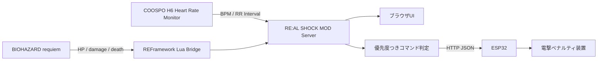

<p align="center">
  
</p>

# RE:AL SHOCK MOD


**RE:AL SHOCK MOD** は、**バイオハザード レクイエム / BIOHAZARD requiem** のプレイ状態と、プレイヤー本人の心拍・心拍間隔を同時に監視し、同じネットワーク内の **ESP32** へ「今どんな罰ゲーム状態か」を送るローカルシステムです。

日本語版READMEがメインです。英語版はこちら: [README.en.md](README.en.md)

> **狙い**
>
> ゲーム内でダメージを食らう、死亡する、HPが危険域に入る、または現実のプレイヤーがびっくりする。  
> その瞬間を検知してESP32へコマンドを送り、ESP32側の装置が現実世界のプレイヤーへ電撃ペナルティを与える、という実験的なMOD連携です。

> [!WARNING]
> 電気刺激は危険を伴います。このリポジトリはESP32へコマンドJSONを送るところまでを扱います。高電圧回路や危険な電撃装置の作り方は含めません。実験する場合は、安全な市販機器、絶縁、低出力、非常停止、第三者確認を必ず用意してください。

## 目次

- [システム概要](#システム概要)
- [READMEの画像について](#readmeの画像について)
- [画面とコマンドの対応](#画面とコマンドの対応)
- [生体データで何を見るか](#生体データで何を見るか)
- [ESP32へ送るコマンド](#esp32へ送るコマンド)
- [導入方法](#導入方法)
- [起動方法](#起動方法)
- [設定](#設定)
- [API](#api)
- [おまけ: 実測データ](#おまけ-実測データ)
- [構成](#構成)

## システム概要



このシステムはPC内で動く1つのサーバーにまとめています。

| 入力 | 読み取るもの | 使い道 |
|---|---|---|
| REFramework Lua Bridge | HP、最大HP、HP割合、ダメージ回数、死亡、ふらつき | ゲーム内の失敗・危険状態を検知 |
| COOSPO H6 | BPM、RR interval、RMSSD、SDNN、pNN50 | びっくり・緊張・体動っぽさを推定 |
| 優先度エンジン | `death > damage > startle > faltering > none` | 同時発生時に1つのコマンドへ整理 |
| ESP32 HTTP | JSONコマンド | LAN内のESP32へ罰ゲーム指令を送信 |

## READMEの画像について

README内のUI画像は、**実際の `static/index.html` / `static/app.js` / `static/styles.css` を使い、`?demo=` の疑似データモードで表示して撮影**しています。生成AIで作った架空UI画像ではありません。

プレイ画面は作者提供のスクリーンショットです。  
生体波形は、同梱している実測CSVから作ったグラフです。

## 画面とコマンドの対応

### 1. 通常プレイ: `none`

ゲーム内に危険イベントがなく、生体反応も落ち着いている状態です。ESP32には「何もない」状態として `none` を送り、出力を解除または待機状態にします。

| プレイ画面 | RE:AL SHOCK MOD UI |
|---|---|
|  |  |

```json
{
  "command": "none",
  "priority": 0
}
```

### 2. ダメージ: `damage`

HPが減る、またはLua Bridge側のダメージ回数が増えた時に発行します。びっくり反応も同時に出やすいですが、優先度は `damage` の方が上です。

| プレイ画面 | RE:AL SHOCK MOD UI |
|---|---|
|  |  |

```json
{
  "command": "damage",
  "priority": 3,
  "payload": {
    "hp_percent": 42,
    "damage_count": 7
  }
}
```

### 3. ふらつき: `faltering`

HPが **16.75%以下** になった時の危険状態です。死亡やダメージほど強くはありませんが、プレイヤーに「もうまずい」と知らせる低めのペナルティや警告パルスに向いています。

| プレイ画面 | RE:AL SHOCK MOD UI |
|---|---|
|  |  |

```json
{
  "command": "faltering",
  "priority": 1,
  "payload": {
    "hp_percent": 14.8
  }
}
```

### 4. 死亡: `death`

HPが0になった時の最優先コマンドです。`damage`、`startle`、`faltering` が同時に起きていても、最終的にESP32へ送るのは `death` です。

| プレイ画面 | RE:AL SHOCK MOD UI |
|---|---|
|  |  |

```json
{
  "command": "death",
  "priority": 4
}
```

### 5. びっくり: `startle`

ゲーム側にダメージがなくても、心拍間隔の急な短縮と遅れてくるBPM上昇が出た場合に発行します。過去データの検証から、現在は反応後 **3秒** 追跡して、姿勢変化だけの反応をできるだけ外すロジックにしています。

| 参考プレイ画面 | RE:AL SHOCK MOD UI |
|---|---|
|  |  |

```json
{
  "command": "startle",
  "priority": 2,
  "source": "h6-detector"
}
```

## 生体データで何を見るか

心拍数だけで「怖がっている」と決めるのは弱いです。RE:AL SHOCK MODでは、主に以下をまとめて見ます。

| 指標 | 見たい変化 | 意味 |
|---|---|---|
| BPM | 数秒遅れて上がる | びっくり後の反応や緊張上昇 |
| RR interval | 急に短くなる | びっくりの初動として出やすい |
| RMSSD / pNN50 | 下がる | リラックスから緊張寄りへ変わるヒント |
| 体動スコア | 大きく跳ねる | 姿勢変化・あくびなどの誤検知候補 |
| 直近平均との差 | 普段の自分からのズレ | 個人差を吸収するための基準 |

同梱CSVには、ホラー映画、バイオハザード、コンジアム、姿勢変化、あくびなどの実測データを入れています。びっくり判定と誤検知の境界は、これらを混ぜて見ながら調整しています。

## ESP32へ送るコマンド

ESP32のエンドポイントを環境変数で指定します。

```powershell
$env:REAL_SHOCK_ESP32_URL = "http://192.168.0.50/command"
```

コマンドが変化すると、同じネットワーク内のESP32へHTTP JSONを送ります。

```json
{
  "system": "RE:AL SHOCK MOD",
  "command": "damage",
  "label": "ダメージ",
  "priority": 3,
  "source": "re9-bridge",
  "issued_at": "2026-05-18T02:18:42.120",
  "payload": {
    "hp_percent": 42,
    "damage_count": 7
  }
}
```

| 優先度 | コマンド | 想定するESP32側の意味 |
|---:|---|---|
| 4 | `death` | ゲームオーバー用の最強ペナルティ |
| 3 | `damage` | 被弾時の強めペナルティ |
| 2 | `startle` | 現実のびっくり反応への短いペナルティ |
| 1 | `faltering` | HP危険域の警告パルス |
| 0 | `none` | 出力なし、待機、解除 |

> [!IMPORTANT]
> PCアプリは「どの状態か」を送るだけです。出力上限、連続出力禁止、非常停止、ウォッチドッグなどの安全制御はESP32側でも必ず持たせてください。

## 導入方法

### かんたん導入

1. このリポジトリをダウンロード、またはcloneします。
2. フォルダ内のこれをダブルクリックします。

```text
Install-RE-AL-SHOCK-MOD.cmd
```

インストーラーは以下を行います。

- Python依存パッケージの導入
- REFramework Lua Bridgeの配置
- デスクトップショートカット作成
- 起動用 `.cmd` の準備

### REFrameworkも入れたい場合

PowerShellでリポジトリフォルダを開いて実行します。

```powershell
.\scripts\Install-RealShockMod.ps1 -InstallRe9Bridge -InstallREFramework -IUnderstandGameMayBeAffected
```

`-InstallREFramework` はゲームフォルダに `dinput8.dll` を配置します。ゲームの動作に影響する可能性があるため、意図している時だけ使ってください。

### Lua Bridgeだけ入れる場合

```powershell
.\scripts\Install-Re9Bridge.ps1 -InstallLua
```

### 状態確認だけしたい場合

```powershell
.\scripts\Install-Re9Bridge.ps1
```

引数なしではファイルを書き換えません。

## 起動方法

ダブルクリックで起動します。

```text
Start-RE-AL-SHOCK-MOD.cmd
```

またはPowerShellから起動します。

```powershell
.\scripts\Start-RealShockMod.ps1
```

起動後、ブラウザで開きます。

```text
http://127.0.0.1:8765/
```

README用のデモ画面を確認したい場合は、以下のように開けます。

```text
http://127.0.0.1:8765/?demo=damage
```

使えるデモ値は `normal`、`startle`、`damage`、`faltering`、`death` です。

## 設定

環境変数で設定できます。

```powershell
$env:REAL_SHOCK_PORT = "8765"
$env:REAL_SHOCK_H6_ADDRESS = ""
$env:REAL_SHOCK_H6_NAME_PREFIX = "H6"
$env:REAL_SHOCK_ESP32_URL = "http://192.168.0.50/command"
$env:REAL_SHOCK_ESP32_TIMEOUT = "2.0"
```

| 変数 | 説明 |
|---|---|
| `REAL_SHOCK_PORT` | ローカルサーバーのポート |
| `REAL_SHOCK_H6_ADDRESS` | 特定のBLEアドレスを指定。空なら自動検出 |
| `REAL_SHOCK_H6_NAME_PREFIX` | 自動検出する心拍センサ名の先頭 |
| `REAL_SHOCK_ESP32_URL` | ESP32へ送るHTTP URL |
| `REAL_SHOCK_ESP32_TIMEOUT` | ESP32送信のタイムアウト秒 |

## API

| Method | Path | 用途 |
|---|---|---|
| `GET` | `/` | メインUI |
| `GET` | `/api/snapshot` | 全状態 |
| `GET` | `/api/game` | バイオハザード側の状態 |
| `GET` | `/api/commands` | 発行中コマンド |
| `GET` | `/api/esp32` | ESP32送信状態 |
| `POST` | `/api/debug/command/death` | デバッグ用死亡コマンド |
| `POST` | `/api/debug/command/damage` | デバッグ用ダメージコマンド |
| `POST` | `/api/debug/command/startle` | デバッグ用びっくりコマンド |
| `POST` | `/api/debug/command/faltering` | デバッグ用ふらつきコマンド |
| `POST` | `/api/debug/command/none` | コマンド解除 |

## おまけ: 実測データ

作者がCOOSPO H6で取った実測データを、おまけとして同梱しています。

```text
docs/sample-data/biometric/
```

含まれているデータ例:

| データ | 内容 |
|---|---|
| `relax.csv` | リラックス状態 |
| `resident-evil.csv` | バイオハザードプレイ |
| `horror-movie.csv` | ホラームービー |
| `horror-friends-house.csv` | ホラームービー「友達の家」 |
| `gonjiam.csv` | 長時間ホラー映画「コンジアム」 |
| `the-girl-encounter.csv` | The Girl遭遇 |
| `yawn.csv` | あくびによる誤検知候補 |
| `posture-heavy.csv` / `single-posture.csv` | 姿勢変化テスト |

詳しくは [docs/sample-data/biometric/README.md](docs/sample-data/biometric/README.md) と [manifest.json](docs/sample-data/biometric/manifest.json) を見てください。

## 構成

```text
h6_monitor_server.py          aiohttp + BLE + RE9 + ESP32 サーバー
static/                       1画面完結のブラウザUI
reframework/                  REFramework Lua Bridge
scripts/                      導入、起動、ショートカット作成スクリプト
docs/images/                  README用スクリーンショット、波形画像
docs/sample-data/biometric/   実測CSVデータ
Install-RE-AL-SHOCK-MOD.cmd   ダブルクリック導入
Start-RE-AL-SHOCK-MOD.cmd     ダブルクリック起動
```

## 権利と注意

このプロジェクトは個人実験用のローカルMOD連携ツールです。Capcom、BIOHAZARD、Resident Evil、Steam、COOSPO、REFrameworkとは無関係です。  
日本国内のタイトル表記は、カプコン発表の [『バイオハザード レクイエム』](https://www.capcom.co.jp/ir/news/html/250609.html) に合わせています。
