<p align="center">
  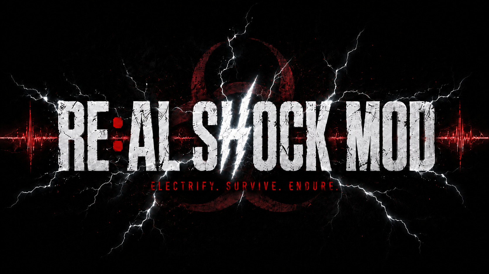
</p>

# RE:AL SHOCK MOD


**ゲーム内のダメージが、現実の電撃になる。**

**RE:AL SHOCK MOD** は、**バイオハザード レクイエム / BIOHAZARD requiem** のプレイ状態と、プレイヤー本人の心拍データを監視して、被弾・死亡・ふらつき・びっくりに応じたコマンドを **ESP32** へ送るローカルMOD連携システムです。

ESP32側はそのコマンドを受け取り、現実世界のプレイヤーに電撃ペナルティを与える。  
つまり、ゲームで痛い目を見ると、ちゃんと現実でも痛い目を見るための装置です。

English version: [README.en.md](README.en.md)

<p align="center">
  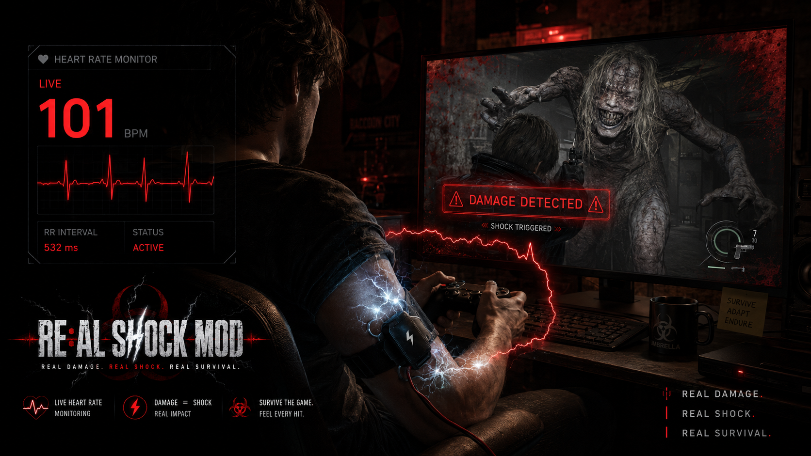
</p>

## 今回使った主な材料

### 買うもの

| 画像 | URL | 何か |
|---|---|---|
|  | [COOSPO 心拍センサー / ハートレートモニター](https://amzn.asia/d/03qclP31) | プレイヤーの心拍数とRR intervalを取る胸ベルト型センサー |
|  | [RELX EMSベルト](https://amzn.asia/d/0725U7pu) | ESP32から制御する電撃ペナルティ側のベース装置 |
|  | [DiyStudio ESP32 開発ボード](https://amzn.asia/d/06wo77h9) | PCからHTTPコマンドを受け取るWi-Fi/Bluetooth開発ボード |
|  | [KKHMF 5V 1チャンネルリレーモジュール](https://amzn.asia/d/0ijeHtMs) | ESP32の信号で外部装置のON/OFFを切り替えるリレー |

### PCに入れるもの

| リンク | 何か |
|---|---|
| [Git for Windows](https://git-scm.com/download/win) | `git clone` するために必要 |
| [Python 3.10+](https://www.python.org/downloads/windows/) | RE:AL SHOCK MODのローカルサーバーを動かす |
| [REFramework Releases](https://github.com/praydog/REFramework/releases) | バイオハザード側の状態を読むMOD基盤。スクリプトから自動導入も可能 |

## 最短セットアップ

まずはPowerShellを開いて、入っていないものを入れます。

```powershell
winget install --id Git.Git -e
winget install --id Python.Python.3.12 -e
```

次に、好きな場所でこの通りに打ちます。

```powershell
git clone https://github.com/Saisei2004/real-shock-mod.git
cd real-shock-mod
.\Install-RE-AL-SHOCK-MOD.cmd
.\Start-RE-AL-SHOCK-MOD.cmd
```

起動したらブラウザで開きます。

```text
http://127.0.0.1:8765/
```

REFrameworkもまだ入っていないPCなら、インストール時はこっちを使います。

```powershell
.\scripts\Install-RealShockMod.ps1 -InstallRe9Bridge -InstallREFramework -IUnderstandGameMayBeAffected
```

ESP32へ送る場合は、起動前にESP32のURLを指定します。

```powershell
$env:REAL_SHOCK_ESP32_URL = "http://192.168.0.50/command"
.\Start-RE-AL-SHOCK-MOD.cmd
```

## これがやりたい

プレイヤーは普通にバイオを遊ぶ。  
でも裏では、PCがゲームと体をずっと見ています。

| 起きたこと | MODが見るもの | 現実で起きること |
|---|---|---|
| 敵に噛まれる / 攻撃される | HP低下、ダメージ回数 | ESP32へ `damage`、電撃 |
| 死ぬ | HP 0、死亡状態 | ESP32へ `death`、最強ペナルティ |
| HPが危険域に入る | HP 16.75%以下 | ESP32へ `faltering`、警告ショック |
| ガチでびっくりする | RR interval急落、BPM上昇 | ESP32へ `startle`、リアクション罰 |
| 何もない | 平常状態 | ESP32へ `none`、出力解除 |

コンセプトはシンプルです。

```text
REAL DAMAGE. REAL SHOCK. REAL SURVIVAL.
```

## 全体像

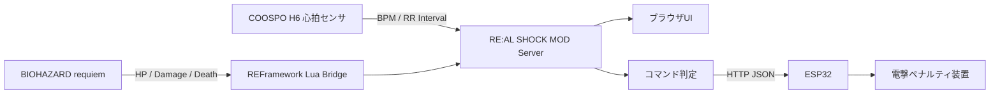

このリポジトリに入っているもの:

| パーツ | 役割 |
|---|---|
| Pythonサーバー | BLE心拍、REFramework Bridge、ESP32送信、Web UIをまとめる |
| REFramework Lua Bridge | バイオハザード側のHPやダメージ状態をPCへ出す |
| ブラウザUI | 生体信号、ゲーム状態、発行中コマンドを1画面で見る |
| ESP32送信 | 同じネットワーク内のESP32へコマンドJSONを送る |
| 実測データ | 作者の心拍ログ。びっくり判定の調整用おまけ |

## 優先度

同時に複数のイベントが起きたら、強いものを優先します。

```text
death > damage > startle > faltering > none
```

| 優先度 | コマンド | 意味 |
|---:|---|---|
| 4 | `death` | 死亡。最優先 |
| 3 | `damage` | 被弾、HP低下 |
| 2 | `startle` | 現実のびっくり反応 |
| 1 | `faltering` | HP危険域、ふらつき |
| 0 | `none` | 何もない、解除 |

## 画面とコマンド

### 通常: `none`

何も起きていない時も、ESP32へ `none` を送ります。これは「コマンドなし」ではなく、装置側に出力解除を伝えるアイドル状態です。

| プレイ画面 | RE:AL SHOCK MOD UI |
|---|---|
| 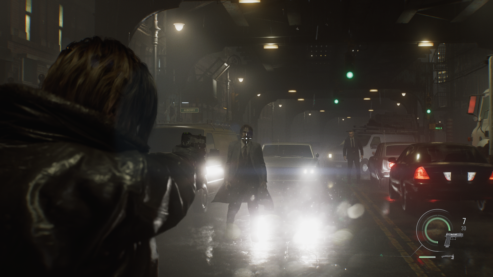 | 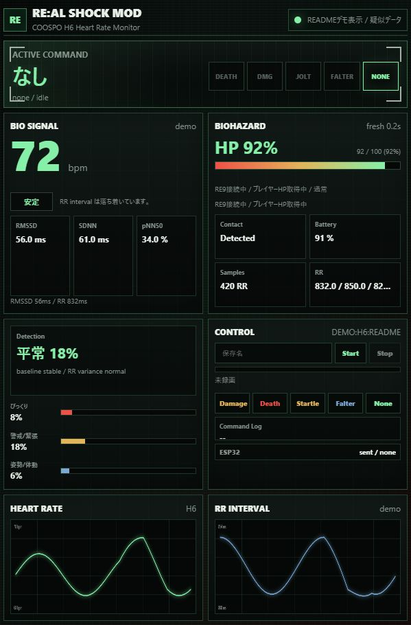 |

### ダメージ: `damage`

HPが減ったら、現実にも返す。  
このMODの一番わかりやすい部分です。

| プレイ画面 | RE:AL SHOCK MOD UI |
|---|---|
| 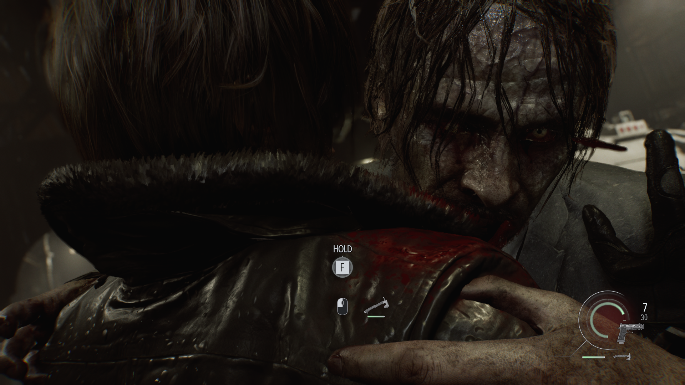 | 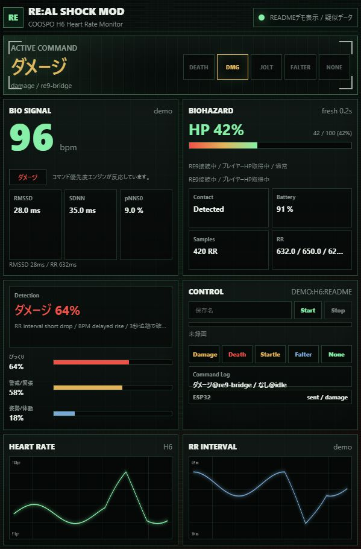 |

```json
{
  "command": "damage",
  "priority": 3,
  "payload": {
    "hp_percent": 42,
    "damage_count": 7
  }
}
```

### ふらつき: `faltering`

HPが **16.75%以下** になると危険域です。死亡や被弾ほど強くはないけど、「もうまずいぞ」という警告ショックに使います。

| プレイ画面 | RE:AL SHOCK MOD UI |
|---|---|
| 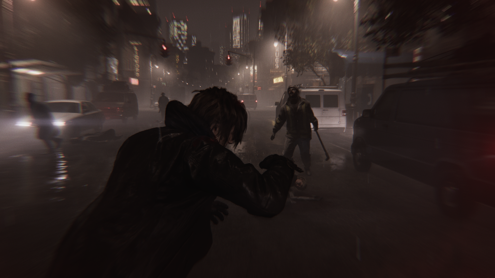 | 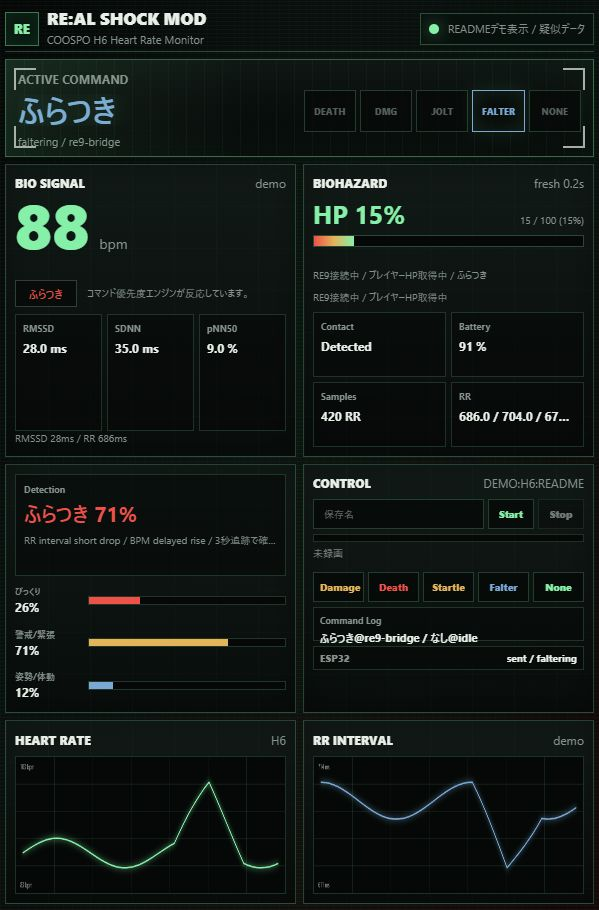 |

### 死亡: `death`

ゲームオーバーは最優先。  
`damage` や `startle` が同時に出ていても、最後に勝つのは `death` です。

| プレイ画面 | RE:AL SHOCK MOD UI |
|---|---|
| 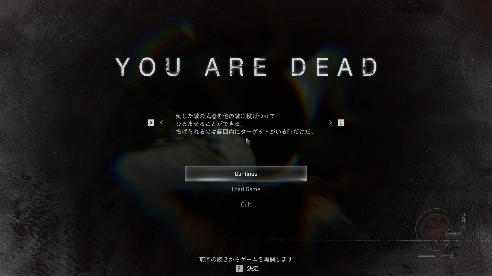 | 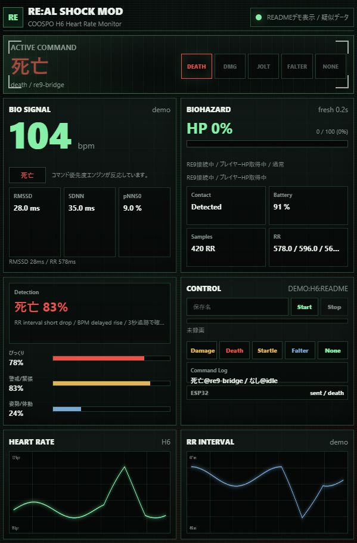 |

### びっくり: `startle`

ゲーム側の被弾がなくても、心拍間隔の急な変化から「今ビビったな」を拾います。  
現在は反応後 **3秒** 追跡して、姿勢変化やあくびによる誤検知をできるだけ外すロジックにしています。

| 参考プレイ画面 | RE:AL SHOCK MOD UI |
|---|---|
|  | 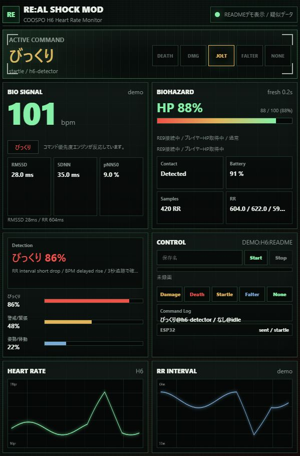 |

## 生体データで見るもの

心拍数だけだと弱いので、心拍間隔も見ます。

| 指標 | 見たい変化 |
|---|---|
| BPM | 数秒遅れて上がる |
| RR interval | びっくり直後に短くなる |
| RMSSD / pNN50 | 緊張寄りになると下がりやすい |
| 体動スコア | 姿勢変化、あくび、ノイズを疑う |
| 直近平均との差 | 自分の平常からどれだけズレたかを見る |

同梱CSVには、ホラー映画、バイオハザード、コンジアム、姿勢変化、あくびなどの実測データを入れています。判定ロジックは、このへんの「本物のびっくり」と「ただの体動」を見比べながら調整しています。

## ESP32へ送るJSON

ESP32のHTTPエンドポイントを設定します。

```powershell
$env:REAL_SHOCK_ESP32_URL = "http://192.168.0.50/command"
```

送信例:

```json
{
  "system": "RE:AL SHOCK MOD",
  "command": "damage",
  "label": "ダメージ",
  "priority": 3,
  "source": "re9-bridge",
  "issued_at": "2026-05-18T02:18:42.120",
  "payload": {
    "hp_percent": 42,
    "damage_count": 7
  }
}
```

ESP32側では、この `command` を見て電撃パターンを変える想定です。

| コマンド | 例 |
|---|---|
| `none` | 出力解除 |
| `faltering` | 軽い警告 |
| `startle` | 短い電撃 |
| `damage` | 被弾ペナルティ |
| `death` | ゲームオーバーペナルティ |

## 導入方法の補足

基本は [最短セットアップ](#最短セットアップ) のコマンドを上から実行すればOKです。ここでは、個別にやりたい場合のコマンドだけまとめます。

### リポジトリを取得

GitHubから取る場合:

```powershell
git clone https://github.com/Saisei2004/real-shock-mod.git
cd real-shock-mod
```

ZIPで取る場合:

[Download ZIP](https://github.com/Saisei2004/real-shock-mod/archive/refs/heads/main.zip)

### インストール

```powershell
.\Install-RE-AL-SHOCK-MOD.cmd
```

これでPython依存パッケージ、Lua Bridge、デスクトップショートカットをまとめて準備します。

### REFrameworkも入れたい場合

```powershell
.\scripts\Install-RealShockMod.ps1 -InstallRe9Bridge -InstallREFramework -IUnderstandGameMayBeAffected
```

### Lua Bridgeだけ入れる場合

```powershell
.\scripts\Install-Re9Bridge.ps1 -InstallLua
```

### 状態確認だけしたい場合

```powershell
.\scripts\Install-Re9Bridge.ps1
```

## 起動方法

デスクトップショートカット、または以下のコマンドで起動します。

```text
Start-RE-AL-SHOCK-MOD.cmd
```

または:

```powershell
.\scripts\Start-RealShockMod.ps1
```

起動後に開く:

```text
http://127.0.0.1:8765/
```

README用の疑似デモUI:

```text
http://127.0.0.1:8765/?demo=damage
```

使えるデモ値は `normal`、`startle`、`damage`、`faltering`、`death` です。

## 設定

```powershell
$env:REAL_SHOCK_PORT = "8765"
$env:REAL_SHOCK_H6_ADDRESS = ""
$env:REAL_SHOCK_H6_NAME_PREFIX = "H6"
$env:REAL_SHOCK_ESP32_URL = "http://192.168.0.50/command"
$env:REAL_SHOCK_ESP32_TIMEOUT = "2.0"
```

| 変数 | 説明 |
|---|---|
| `REAL_SHOCK_PORT` | ローカルサーバーのポート |
| `REAL_SHOCK_H6_ADDRESS` | BLEアドレス指定。空なら自動検出 |
| `REAL_SHOCK_H6_NAME_PREFIX` | 心拍センサ名の先頭 |
| `REAL_SHOCK_ESP32_URL` | ESP32へ送るHTTP URL |
| `REAL_SHOCK_ESP32_TIMEOUT` | ESP32送信タイムアウト秒 |

## API

| Method | Path | 用途 |
|---|---|---|
| `GET` | `/` | メインUI |
| `GET` | `/api/snapshot` | 全状態 |
| `GET` | `/api/game` | バイオハザード側の状態 |
| `GET` | `/api/commands` | 発行中コマンド |
| `GET` | `/api/esp32` | ESP32送信状態 |
| `POST` | `/api/debug/command/death` | デバッグ用死亡コマンド |
| `POST` | `/api/debug/command/damage` | デバッグ用ダメージコマンド |
| `POST` | `/api/debug/command/startle` | デバッグ用びっくりコマンド |
| `POST` | `/api/debug/command/faltering` | デバッグ用ふらつきコマンド |
| `POST` | `/api/debug/command/none` | コマンド解除 |

## おまけ: 実測データ

作者がCOOSPO H6で取った実測データを同梱しています。

```text
docs/sample-data/biometric/
```

| データ | 内容 |
|---|---|
| `relax.csv` | リラックス状態 |
| `resident-evil.csv` | バイオハザードプレイ |
| `horror-movie.csv` | ホラームービー |
| `horror-friends-house.csv` | ホラームービー「友達の家」 |
| `gonjiam.csv` | 長時間ホラー映画「コンジアム」 |
| `the-girl-encounter.csv` | The Girl遭遇 |
| `yawn.csv` | あくびによる誤検知候補 |
| `posture-heavy.csv` / `single-posture.csv` | 姿勢変化テスト |

詳しくは [docs/sample-data/biometric/README.md](docs/sample-data/biometric/README.md) と [manifest.json](docs/sample-data/biometric/manifest.json) を見てください。

## 構成

```text
h6_monitor_server.py          aiohttp + BLE + RE9 + ESP32 サーバー
static/                       1画面完結のブラウザUI
reframework/                  REFramework Lua Bridge
scripts/                      導入、起動、ショートカット作成スクリプト
docs/images/                  README用画像
docs/sample-data/biometric/   実測CSVデータ
Install-RE-AL-SHOCK-MOD.cmd   ダブルクリック導入
Start-RE-AL-SHOCK-MOD.cmd     ダブルクリック起動
```

## 画像について

README内のUI画像は、実際の `static/index.html` / `static/app.js` / `static/styles.css` を使い、`?demo=` の疑似データモードで表示して撮影しています。  
プレイ画面は作者提供のスクリーンショットです。コンセプト画像とロゴは、このプロジェクトの見た目を伝えるためのビジュアルです。

## 注意

このプロジェクトは個人実験用のローカルMOD連携ツールです。Capcom、BIOHAZARD、Resident Evil、Steam、COOSPO、REFrameworkとは無関係です。  
日本国内のタイトル表記は、カプコン発表の [『バイオハザード レクイエム』](https://www.capcom.co.jp/ir/news/html/250609.html) に合わせています。

電気刺激を扱う場合は自己責任です。PCアプリはESP32へコマンドを送るだけなので、出力制限、連続出力防止、非常停止などの安全制御はESP32側や外部装置側で必ず用意してください。
