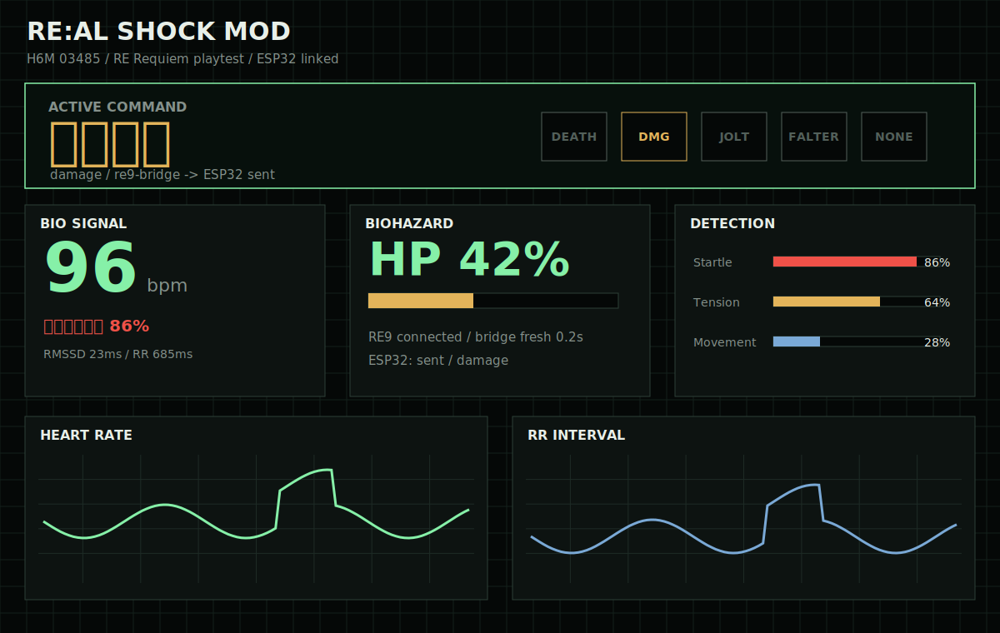
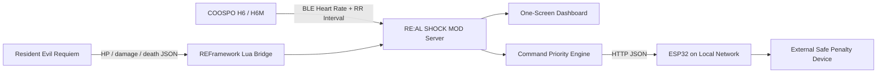
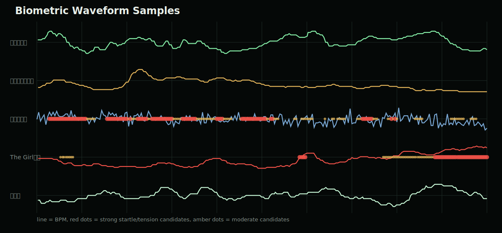

# RE:AL SHOCK MOD


**RE:AL SHOCK MOD** is a local Windows system that watches **Resident Evil Requiem / BIOHAZARD Requiem**, reads the player's HP state through a REFramework Lua bridge, reads the player's real biometric signal from a Bluetooth heart-rate sensor, and emits a prioritized command to an ESP32 on the same network.

The concept is simple:

> **If the player gets hit, dies, falters, or physically startles, the system sends a penalty command.**

In the intended setup, the ESP32 receives that command and controls an external shock/penalty device for a party-game style punishment loop.

> [!WARNING]
> Electrical stimulation can be dangerous. This repository only sends command JSON to an ESP32 endpoint. It does not include high-voltage circuit designs or instructions for building unsafe shock hardware. Use only safe, isolated, purpose-built devices, keep intensity limits conservative, and keep an emergency stop outside the software path.



## Table Of Contents

- [What It Does](#what-it-does)
- [Game States](#game-states)
- [Command Priority](#command-priority)
- [Biometric Detection](#biometric-detection)
- [ESP32 Command Output](#esp32-command-output)
- [Install](#install)
- [Launch](#launch)
- [Configuration](#configuration)
- [Local API](#local-api)
- [Sample Data](#sample-data)
- [Repository Layout](#repository-layout)

## What It Does



The server runs locally at:

```text
http://127.0.0.1:8765/
```

It combines two worlds:

| Input | What is read | Why it matters |
|---|---|---|
| REFramework Lua | HP, max HP, HP percent, damage count, low HP/faltering state | Detects game failure and danger |
| COOSPO H6/H6M BLE | BPM, RR interval, RMSSD, SDNN, pNN50 | Detects real startle/tension response |
| Priority engine | `death > damage > startle > faltering > none` | Ensures the strongest event wins |
| ESP32 endpoint | HTTP JSON command | Lets external hardware react on the LAN |

## Game States

The screenshots below are playtest references used to tune the command mapping.

| Normal Play | Damage |
|---|---|
|  |  |
| No penalty command unless the biometric detector sees a startle. | `damage` is emitted when damage count increases or HP drops. |

| Faltering | Game Over |
|---|---|
|  |  |
| `faltering` is emitted below the low-HP threshold. | `death` overrides every other command. |

The faltering threshold is currently:

```text
HP <= 16.75%
```

The bridge also respects `faltering_low_hp` when the Lua side can classify the RE vital state directly.

## Command Priority

When multiple events happen at once, the system emits only the highest-priority active command.

| Priority | Command | Trigger | Default Hold |
|---:|---|---|---:|
| 4 | `death` | HP percent is 0 or lower | Latched until HP recovers |
| 3 | `damage` | Damage counter increases or HP decreases | 3.0s |
| 2 | `startle` | Heart-rate detector confirms a startle candidate | 3.5s |
| 1 | `faltering` | HP is 16.75% or lower / faltering state | 1.2s refreshed |
| 0 | `none` | No active command | Continuous idle state |

<details>
<summary>Example command state</summary>

```json
{
  "kind": "damage",
  "label": "ダメージ",
  "source": "re9-bridge",
  "priority": 3,
  "payload": {
    "hp": 42,
    "max_hp": 100,
    "hp_percent": 42,
    "amount": 18,
    "damage_count": 7
  }
}
```

</details>

## Biometric Detection

The biometric side watches real-time heart-rate behavior:

- BPM rise
- RR interval shortening
- RMSSD / pNN50 drop
- short-term startle spikes
- sustained tension windows
- posture/movement-like false positives

The current dashboard shows both the live signal and the detector score stack. The graph below is generated from the included real playtest data.



Red markers are strong startle/tension candidates. Amber markers are moderate candidates. This makes it easier to compare:

- relaxed baseline
- Resident Evil play
- long horror-movie tension
- yawn false positives
- sudden encounter reactions

## ESP32 Command Output

Set an ESP32 HTTP endpoint with:

```powershell
$env:REAL_SHOCK_ESP32_URL = "http://192.168.0.50/command"
```

Every command-state change is sent as JSON:

```json
{
  "system": "RE:AL SHOCK MOD",
  "command": "damage",
  "label": "ダメージ",
  "priority": 3,
  "source": "re9-bridge",
  "issued_at": "2026-05-18T02:18:42.120",
  "payload": {
    "hp_percent": 42,
    "damage_count": 7
  }
}
```

Recommended ESP32 behavior:

| Command | Suggested interpretation |
|---|---|
| `none` | No penalty / reset output |
| `faltering` | Warning pulse or low-intensity cue |
| `startle` | Short reaction penalty |
| `damage` | Stronger hit penalty |
| `death` | Highest penalty pattern / game-over cue |

> [!IMPORTANT]
> Keep the ESP32 firmware responsible for final safety limits. The PC app should be treated as a signal source, not the final safety controller.

## Install

### Quick Install

1. Download or clone this repository.
2. Double-click:

```text
Install-RE-AL-SHOCK-MOD.cmd
```

This installs Python dependencies, installs the RE9 Lua bridge when possible, and creates a desktop shortcut:

```text
RE AL SHOCK MOD.lnk
```

### If REFramework Is Not Installed

Run PowerShell from the repository folder:

```powershell
.\scripts\Install-RealShockMod.ps1 -InstallRe9Bridge -InstallREFramework -IUnderstandGameMayBeAffected
```

`-InstallREFramework` writes `dinput8.dll` into the game folder. Use it only when you deliberately want REFramework installed.

### Install Only The Lua Bridge

```powershell
.\scripts\Install-Re9Bridge.ps1 -InstallLua
```

### Check RE9 Bridge Status

```powershell
.\scripts\Install-Re9Bridge.ps1
```

No arguments means no files are changed.

## Launch

Double-click:

```text
Start-RE-AL-SHOCK-MOD.cmd
```

Or run:

```powershell
.\scripts\Start-RealShockMod.ps1
```

Then open:

```text
http://127.0.0.1:8765/
```

## Configuration

Environment variables:

```powershell
$env:REAL_SHOCK_PORT = "8765"
$env:REAL_SHOCK_H6_ADDRESS = ""
$env:REAL_SHOCK_H6_NAME_PREFIX = "H6"
$env:REAL_SHOCK_ESP32_URL = "http://192.168.0.50/command"
$env:REAL_SHOCK_ESP32_TIMEOUT = "2.0"
```

Notes:

- Leave `REAL_SHOCK_H6_ADDRESS` empty to auto-detect by BLE name prefix and standard Heart Rate service.
- Set it to a known BLE address when multiple heart-rate sensors are nearby.
- The app binds to `127.0.0.1` by default.

## Local API

| Method | Path | Purpose |
|---|---|---|
| `GET` | `/` | Dashboard |
| `GET` | `/api/snapshot` | Full state snapshot |
| `GET` | `/api/game` | RE9 bridge state |
| `GET` | `/api/commands` | Command priority state |
| `GET` | `/api/esp32` | ESP32 sender status |
| `POST` | `/api/debug/command/death` | Manual death command |
| `POST` | `/api/debug/command/damage` | Manual damage command |
| `POST` | `/api/debug/command/startle` | Manual startle command |
| `POST` | `/api/debug/command/faltering` | Manual faltering command |
| `POST` | `/api/debug/command/none` | Clear to idle |

## Sample Data

Real playtest biometric data is included as an extra reference set:

```text
docs/sample-data/biometric/
```

See:

- [Biometric sample README](docs/sample-data/biometric/README.md)
- [Sample manifest](docs/sample-data/biometric/manifest.json)

The data includes relaxed baseline, Resident Evil play, horror movies, posture-change tests, a yawn false-positive test, and long-form horror tension data.

## Repository Layout

```text
h6_monitor_server.py          Local aiohttp + BLE + RE9 + ESP32 server
static/                       One-screen horror terminal dashboard
reframework/                  RE9 Lua bridge and example config
scripts/                      Windows install/start/shortcut scripts
docs/images/                  README images and waveform graphics
docs/sample-data/biometric/   Real playtest biometric CSV data
Install-RE-AL-SHOCK-MOD.cmd   Double-click installer
Start-RE-AL-SHOCK-MOD.cmd     Double-click launcher
```

## Design Notes

<details>
<summary>Why command priority matters</summary>

If the player takes damage and physically startles at the same time, the system should not emit two competing penalties. The priority engine selects the strongest active state. For example:

```text
death > damage > startle > faltering > none
```

This keeps the ESP32 firmware simple and predictable.

</details>

<details>
<summary>Why RR interval matters</summary>

The detector does not only look at BPM. A sudden startle often appears as RR interval shortening plus a delayed BPM rise. That pattern is more useful than raw BPM alone, especially during horror gameplay where baseline excitement can stay elevated.

</details>

## Disclaimer

This is an experimental local mod/tooling project. It is not affiliated with Capcom, Resident Evil, BIOHAZARD, Steam, COOSPO, or REFramework. Use at your own risk.
