# CAD / 3Dプリント製作ノート

このページは、RE:AL SHOCK MOD の外部デバイス側を作る時の **CAD、3Dプリント、ESP32、A/B/Cボタン制御** をまとめた派生ドキュメントです。

2026-05-30時点では、外部デバイス用の **RE:AL SHOCK BELTケース** をFusionで設計し、Bambu Lab A1でケース本体と上蓋・緊急ボタンを2プレートに分けて印刷しています。

| CAD外観 | 上面 |
|---|---|
| 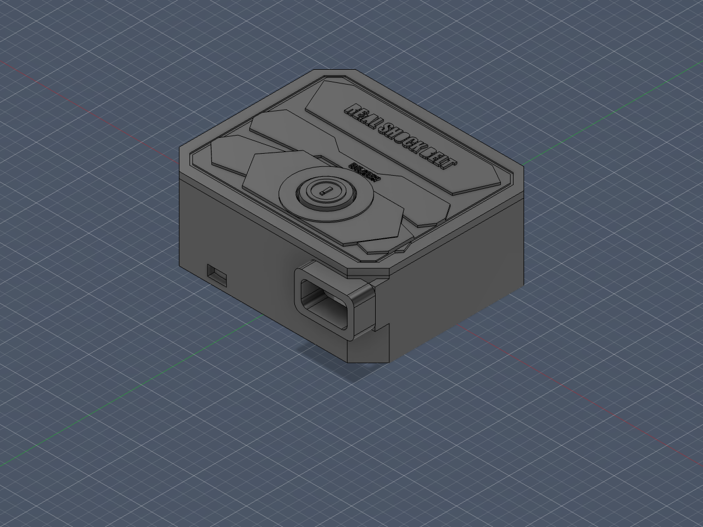 | 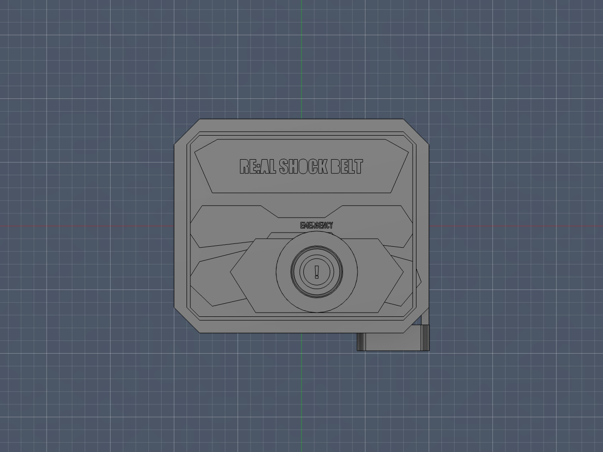 |

| 正面ポート | 底面ソケット |
|---|---|
| 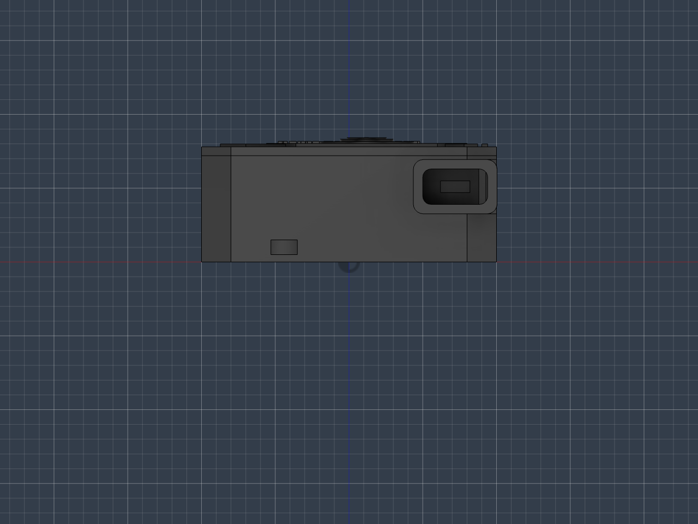 | 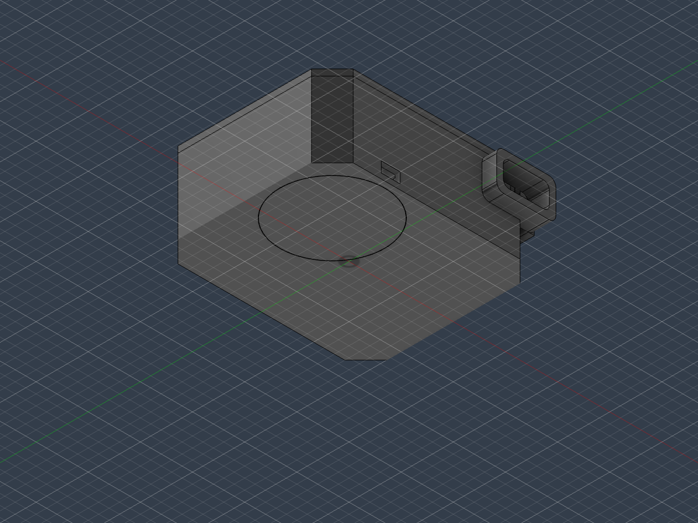 |

## モデルファイル

STLファイルはGitHub上で開くと3Dビューアとして確認できます。編集するときはFusionの `.f3d`、印刷に回すときは各STLを使います。

| ファイル | 内容 |
|---|---|
| [device_case.f3d](models/real-shock-belt-case/device_case.f3d) | Fusion編集用の元データ |
| [CASE_BASE_print.stl](models/real-shock-belt-case/CASE_BASE_print.stl) | ケース本体。底面の接続パーツ受け、PCBポケット、ポート開口を含む |
| [CASE_LID_print.stl](models/real-shock-belt-case/CASE_LID_print.stl) | 上蓋。ブランド文字、保護パネル、緊急ボタンまわりを含む |
| [EMERGENCY_BUTTON_PLUNGER_print.stl](models/real-shock-belt-case/EMERGENCY_BUTTON_PLUNGER_print.stl) | 外側からタクトスイッチを押すための緊急ボタン用プランジャ |

## 今回のケース設計メモ

| 項目 | 設計内容 |
|---|---|
| 外観 | 全体を単色印刷前提にして、斜めカット、段差、外周溝で保護ケースっぽく見せる |
| 底面接続パーツ | 直径約50mm、厚み約12mmの接続パーツを底面から受ける想定 |
| PCB | 約52mm x 60mm x 15mmの基板とESPまわりを収める想定 |
| Micro-B側 | 接続パーツ横の給電ポートにケーブルを通せるよう、下側約5mm位置に開口 |
| Type-C側 | 常時接続前提なので、ケーブルの頭が干渉しにくいように奥行きのある丸角ポート枠にした |
| 緊急ボタン | 直径約7mmのタクトスイッチを外から押すため、別体プランジャを少し飛び出させる |
| 上面文字 | `RE:AL SHOCK BELT` を中央軸で配置し、非常ボタンの近くに `EMERGENCY` 表記を寄せる |
| 印刷分割 | ケース本体、上蓋、緊急ボタン用プランジャの3部品に分ける |

## 全体像

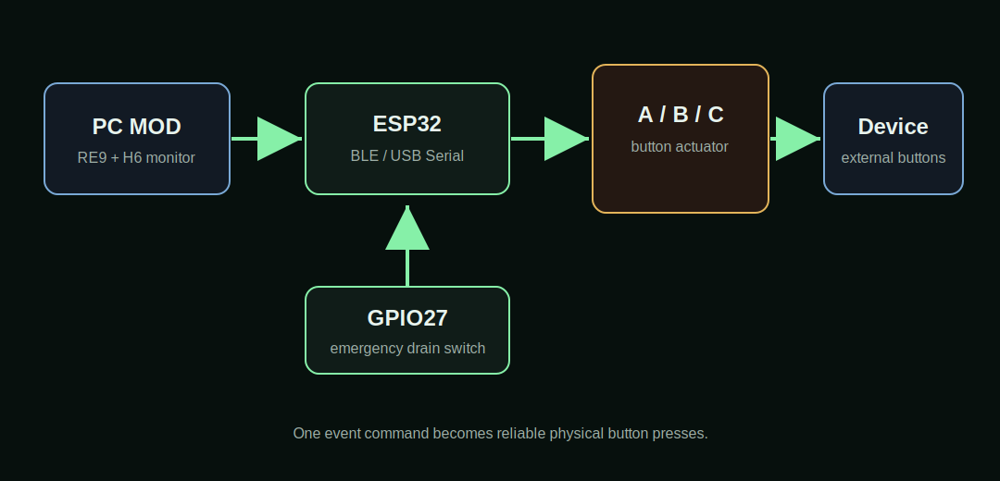

PC側のMODはゲーム状態と心拍データからイベントを作り、ESP32へ `event <kind> <level> <duration_ms> <id>` を送ります。ESP32はそれを外部デバイスのA/B/Cボタン操作に変換します。

## CADで作るもの

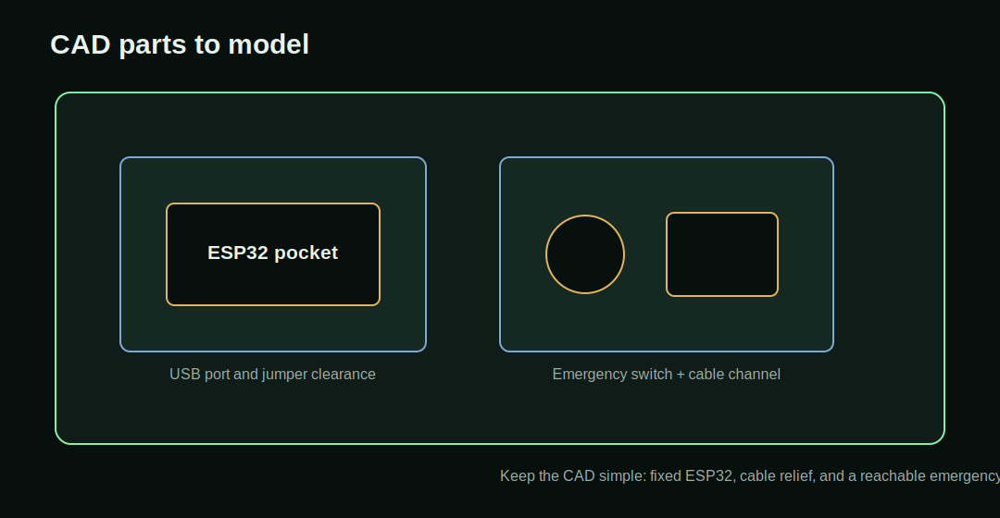

CAD側では、最低限次の3点を決めておくと作業が崩れにくいです。今回のケースでは、これに加えてType-Cケーブルの常時接続、Micro-B給電ポート、底面の丸型接続パーツを先に固定条件として扱いました。

| パーツ | 目的 | 見るポイント |
|---|---|---|
| ESP32固定部 | ESP32をケース内で動かさない | USB端子の向き、ジャンパ線の逃げ |
| 配線逃げ | A/B/C/GND/緊急スイッチ配線を無理なく通す | 線が折れない曲率、抜き差し余裕 |
| タクト穴 | 緊急ドレイン用タクトを押せるようにする | 指で押せるサイズ、誤押ししにくい位置 |

## 3Dプリントの考え方

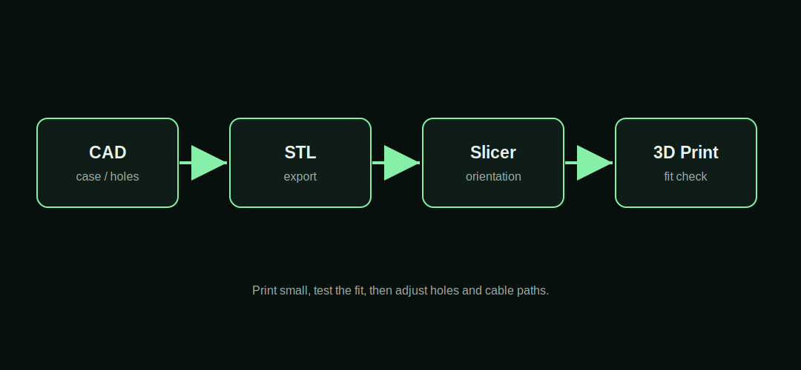

今回の印刷設定メモです。初回出力なので、速度優先ではあるものの、ベッドレベリングとフローキャリブレーションはONにして安全寄りにしています。

| 項目 | 記録 |
|---|---|
| CAD | Autodesk Fusion |
| 3Dプリンター | Bambu Lab A1 |
| スライサー | Bambu Studio |
| 素材 | PLA / A4スロット |
| ノズル径 | 0.4mm |
| プレート | Textured PEI |
| 積層ピッチ | 0.24mm Draft |
| サポート | tree(auto)、しきい値35度 |
| Timelapse | Off |
| Auto Bed Leveling | On |
| Flow Dynamics Calibration | On |

## プリント向き

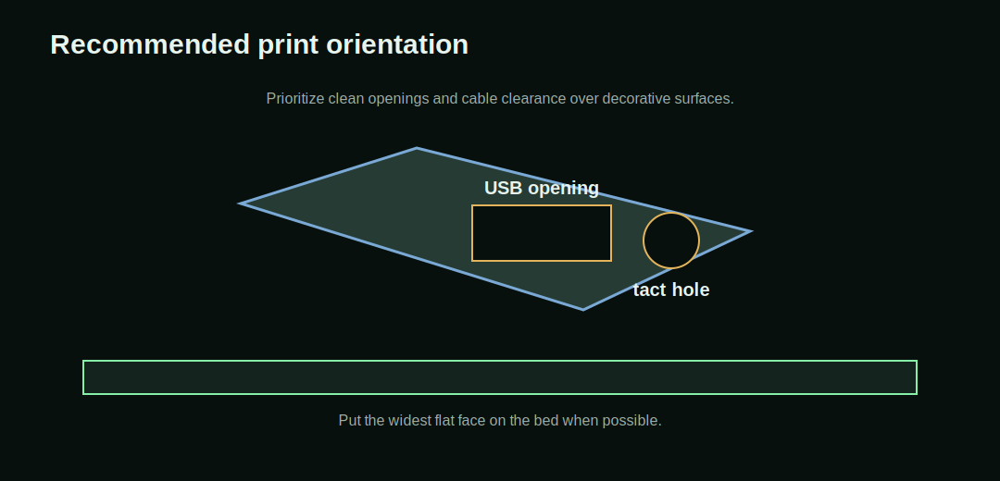

ケースを作る場合は、USB端子穴とタクト穴の仕上がりを優先します。外装の見た目より、配線が無理なく入ること、ESP32を外せること、タクトを確実に押せることを優先します。

今回の出力は2プレートです。

| プレート | 内容 | 見積もり |
|---|---|---|
| Plate 1 | ケース本体 | 約1時間25分、約48.12g |
| Plate 2 | 上蓋、緊急ボタン用プランジャ | 約2時間39分、約49.02g |

Plate 1は底面の接続パーツ受けと内側ポケットがあるため、浮き形状に対してサポートを入れています。Plate 2は上蓋の装飾、ボタン周り、プランジャがあるので、スライス後のサポート量を必ず確認します。

## ESP32とボタン制御

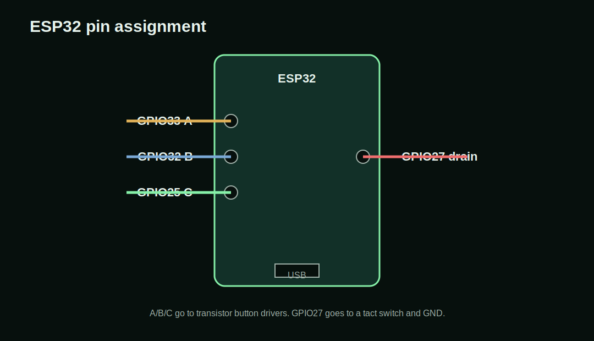

現在の割り当ては次の通りです。

| 機能 | GPIO |
|---|---:|
| A: 威力アップ | 33 |
| B: モード変更 | 32 |
| C: 威力ダウン | 25 |
| 緊急ドレイン用タクト | 27 |

GPIO27の緊急ドレインタクトは `INPUT_PULLUP` で読んでいます。タクトの片側を `GPIO27`、もう片側を `GND` へ接続します。`3V3` にはつなぎません。

## A/B/Cボタンを押す回路

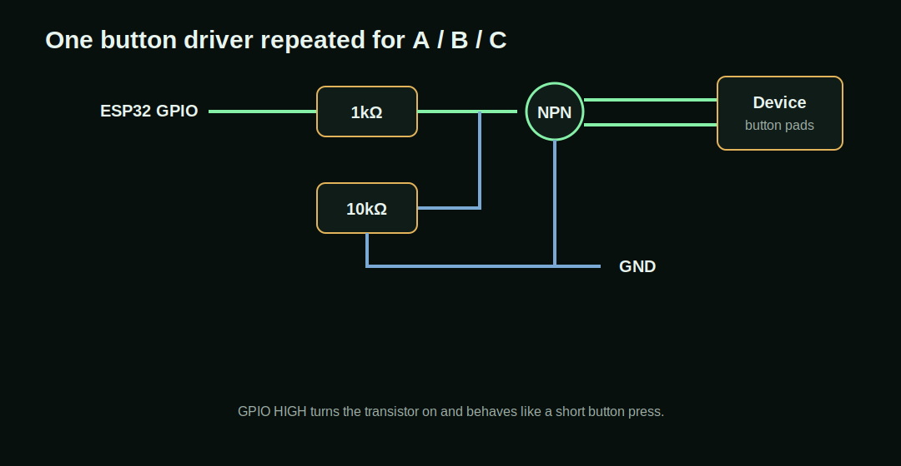

ESP32のGPIOから直接外部デバイスのタクト端子を短絡するのではなく、トランジスタを使って「ボタンを押した状態」を作ります。A/B/Cそれぞれに同じ構成を用意します。

| 部品 | 役割 |
|---|---|
| NPNトランジスタ | 外部デバイスのボタン端子を短絡するスイッチ |
| 1kΩ抵抗 | ESP32 GPIOからベースへ入る電流を制限 |
| 10kΩ抵抗 | ベースをGNDへ落として誤動作を防ぐ |
| ジャンパ線 | ESP32、GND、外部デバイス基板を接続 |

## 緊急ドレインタクト

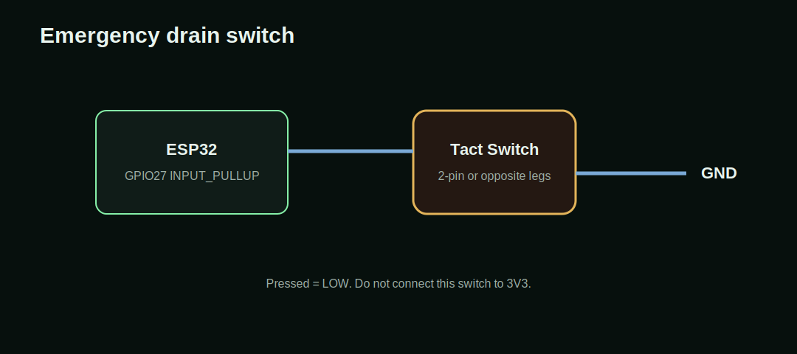

緊急ドレインタクトを1回押すと、ESP32がCボタンを30回連打します。外部デバイス側のレベルが分からなくなった時に、強制的に下げ切るための操作です。

## 組み立て順

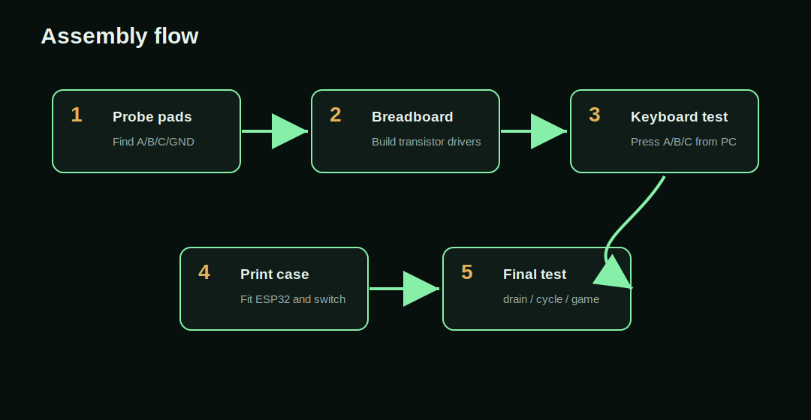

1. 外部デバイスのA/B/C/GND相当をテスターで確認する
2. ブレッドボードでA/B/Cのトランジスタ回路を作る
3. PCから `tools/keyboard_button_control.py` でA/B/Cを手動確認する
4. GPIO27のタクトを `switchtest` で確認する
5. 3DプリントケースへESP32と配線を収める
6. ケースを閉じる前に `drain` と `cycle` を実行する

## デバッグコマンド

```bash
cd /path/to/real-shock-mod
.venv/bin/python tools/esp32_debug.py switchtest 15 --transport serial --port /dev/cu.usbserial-120
.venv/bin/python tools/esp32_debug.py drain --transport serial --port /dev/cu.usbserial-120
.venv/bin/python tools/esp32_debug.py cycle 4 30 --transport serial --port /dev/cu.usbserial-120 --wait 10
```

A/B/CをPCのキーボードから押す場合:

```bash
.venv/bin/python tools/keyboard_button_control.py --port /dev/cu.usbserial-120
```

## 今回追加した成果物

```text
docs/images/hardware/real-shock-belt-case/
docs/models/real-shock-belt-case/
```

スクリーンショットはREADMEとこのページから直接表示し、STLはGitHubの3Dビューアで確認できるようにリンクしています。実機写真や組み立て後の配線写真を追加する場合は、同じ `docs/images/hardware/real-shock-belt-case/` 配下に置くと管理しやすいです。
