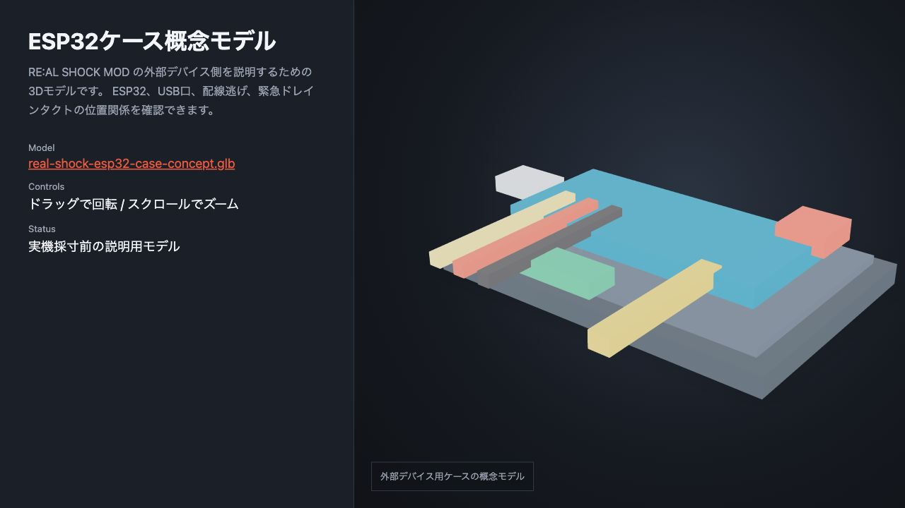

# CAD / 3Dプリント製作ノート

このページは、RE:AL SHOCK MOD の外部デバイス側を作る時の **CAD、3Dプリント、ESP32、A/B/Cボタン制御** をまとめた派生ドキュメントです。

> 現時点では、実機のCADファイルやプリンター写真はリポジトリ未収録です。ここでは現在の配線・制御仕様に合わせた図解を置いています。実写真、CADスクリーンショット、スライサー画像が用意できたら、このページの画像を差し替えるだけで使えます。

## 全体像


PC側のMODはゲーム状態と心拍データからイベントを作り、ESP32へ `event <kind> <level> <duration_ms> <id>` を送ります。ESP32はそれを外部デバイスのA/B/Cボタン操作に変換します。

## 3Dモデルビューア



ブラウザで回転・ズームして確認できる3Dビューアを用意しています。

| リンク | 内容 |
|---|---|
| [3Dビューアを開く](hardware-3d-viewer.html) | `<model-viewer>` でGLBを埋め込んだページ |
| [GLBモデルを直接開く](models/real-shock-esp32-case-concept.glb) | ESP32ケース概念モデル |

このモデルは実機採寸前の説明用です。最終的なCADデータを作ったら、同じ場所に実モデルを書き出して差し替えます。

## CADで作るもの


CAD側では、最低限次の3点を決めておくと作業が崩れにくいです。

| パーツ | 目的 | 見るポイント |
|---|---|---|
| ESP32固定部 | ESP32をケース内で動かさない | USB端子の向き、ジャンパ線の逃げ |
| 配線逃げ | A/B/C/GND/緊急スイッチ配線を無理なく通す | 線が折れない曲率、抜き差し余裕 |
| タクト穴 | 緊急ドレイン用タクトを押せるようにする | 指で押せるサイズ、誤押ししにくい位置 |

## 3Dプリントの考え方


使用プリンター名、ノズル径、素材、積層ピッチはあとから追記できるよう、以下の欄を残しています。

| 項目 | 記録 |
|---|---|
| CAD | 未記録 |
| 3Dプリンター | 未記録 |
| スライサー | 未記録 |
| 素材 | PLA / PETG など |
| ノズル径 | 0.4mm想定 |
| 積層ピッチ | 0.2mm想定 |
| サポート | USB穴やタクト穴の向き次第 |

## プリント向き


ケースを作る場合は、USB端子穴とタクト穴の仕上がりを優先します。外装の見た目より、配線が無理なく入ること、ESP32を外せること、タクトを確実に押せることを優先します。

## ESP32とボタン制御


現在の割り当ては次の通りです。

| 機能 | GPIO |
|---|---:|
| A: 威力アップ | 33 |
| B: モード変更 | 32 |
| C: 威力ダウン | 25 |
| 緊急ドレイン用タクト | 27 |

GPIO27の緊急ドレインタクトは `INPUT_PULLUP` で読んでいます。タクトの片側を `GPIO27`、もう片側を `GND` へ接続します。`3V3` にはつなぎません。

## A/B/Cボタンを押す回路


ESP32のGPIOから直接外部デバイスのタクト端子を短絡するのではなく、トランジスタを使って「ボタンを押した状態」を作ります。A/B/Cそれぞれに同じ構成を用意します。

| 部品 | 役割 |
|---|---|
| NPNトランジスタ | 外部デバイスのボタン端子を短絡するスイッチ |
| 1kΩ抵抗 | ESP32 GPIOからベースへ入る電流を制限 |
| 10kΩ抵抗 | ベースをGNDへ落として誤動作を防ぐ |
| ジャンパ線 | ESP32、GND、外部デバイス基板を接続 |

## 緊急ドレインタクト


緊急ドレインタクトを1回押すと、ESP32がCボタンを30回連打します。外部デバイス側のレベルが分からなくなった時に、強制的に下げ切るための操作です。

## 組み立て順


1. 外部デバイスのA/B/C/GND相当をテスターで確認する
2. ブレッドボードでA/B/Cのトランジスタ回路を作る
3. PCから `tools/keyboard_button_control.py` でA/B/Cを手動確認する
4. GPIO27のタクトを `switchtest` で確認する
5. 3DプリントケースへESP32と配線を収める
6. ケースを閉じる前に `drain` と `cycle` を実行する

## デバッグコマンド

```bash
cd /path/to/real-shock-mod
.venv/bin/python tools/esp32_debug.py switchtest 15 --transport serial --port /dev/cu.usbserial-120
.venv/bin/python tools/esp32_debug.py drain --transport serial --port /dev/cu.usbserial-120
.venv/bin/python tools/esp32_debug.py cycle 4 30 --transport serial --port /dev/cu.usbserial-120 --wait 10
```

A/B/CをPCのキーボードから押す場合:

```bash
.venv/bin/python tools/keyboard_button_control.py --port /dev/cu.usbserial-120
```

## 差し替えたい画像

このページを完成版に近づけるなら、次の画像を追加すると分かりやすくなります。

| 画像 | 置き場所 |
|---|---|
| CAD全体スクリーンショット | `docs/images/hardware/` |
| ケースのスライサープレビュー | `docs/images/hardware/` |
| 使用した3Dプリンターの写真 | `docs/images/hardware/` |
| ブレッドボード配線写真 | `docs/images/hardware/` |
| 完成ケース外観 | `docs/images/hardware/` |
